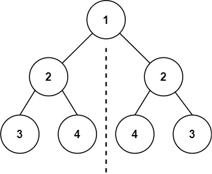

#对称二叉树
## 问题
给你一个二叉树的根节点 root ， 检查它是否轴对称。


示例 1：


```
输入：root = [1,2,2,3,4,4,3]
输出：true
```
示例 2：

```
输入：root = [1,2,2,null,3,null,3]
输出：false
```
## 解答
检查二叉树是否轴对称可以通过递归比较树上对称的节点来实现。具体步骤如下：
1. 如果根节点为空，返回 `True`，因为空树是轴对称的。
2. 定义一个递归函数，该函数接受两个节点作为参数，分别代表需要比较的对称节点。
3. 在递归函数中，首先检查两个节点是否都为空，如果都为空，则返回 `True`。
4. 如果其中一个节点为空，另一个不为空，则树不对称，返回 `False`。
5. 如果两个节点都不为空，但它们的值不相同，则树不对称，返回 `False`。
6. 如果以上情况都不满足，递归地比较第一个节点的左子树与第二个节点的右子树，以及第一个节点的右子树与第二个节点的左子树。
7. 如果所有比较都返回 `True`，则整棵树轴对称。
以下是具体的Python代码实现：
```python
class TreeNode:
    def __init__(self, val=0, left=None, right=None):
        self.val = val
        self.left = left
        self.right = right
def isSymmetric(root: TreeNode) -> bool:
    if not root:
        return True
    def isMirror(t1: TreeNode, t2: TreeNode) -> bool:
        if t1 is None and t2 is None:
            return True
        if t1 is None or t2 is None:
            return False
        return (t1.val == t2.val) and isMirror(t1.left, t2.right) and isMirror(t1.right, t2.left)
    return isMirror(root.left, root.right)
# 示例使用
root1 = TreeNode(1, TreeNode(2, TreeNode(3), TreeNode(4)), TreeNode(2, TreeNode(4), TreeNode(3)))
root2 = TreeNode(1, TreeNode(2, None, TreeNode(3)), TreeNode(2, None, TreeNode(3)))
print(isSymmetric(root1))  # 输出: True
print(isSymmetric(root2))  # 输出: False
```
在这个实现中，`isSymmetric` 函数检查根节点的左右子树是否轴对称，而 `isMirror` 函数用于递归地比较两个节点及其子树。如果所有比较都通过，则返回 `True`，表示树是轴对称的。


