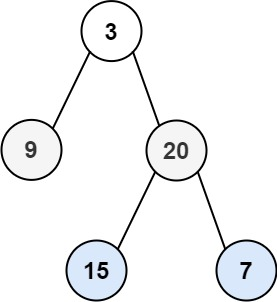

# 二叉树的层序遍历
## 问题
给你二叉树的根节点 root ，返回其节点值的 层序遍历 。 （即逐层地，从左到右访问所有节点）。


示例 1：


```
输入：root = [3,9,20,null,null,15,7]
输出：[[3],[9,20],[15,7]]
```
示例 2：
```
输入：root = [1]
输出：[[1]]
```
示例 3：
```
输入：root = []
输出：[]
```
## 解答
层序遍历二叉树通常使用队列来实现。以下是一个使用队列进行层序遍历的Python示例：
### deque的使用
`deque` 是 Python 标准库 `collections` 模块中的一个类，它提供了两端都可以快速添加（append）和弹出（pop）的序列。这种数据结构非常适合实现队列和栈。
以下是 `deque` 的一些常用方法：
1. `deque([iterable])`：创建一个 deque 对象，可选地从迭代对象中填充数据。
2. `append(x)`：在 deque 的右侧添加一个元素。
3. `appendleft(x)`：在 deque 的左侧添加一个元素。
4. `pop()`：从 deque 的右侧移除并返回一个元素。如果 deque 为空，则引发 `IndexError`。
5. `popleft()`：从 deque 的左侧移除并返回一个元素。如果 deque 为空，则引发 `IndexError`。
6. `extend(iterable)`：从 deque 的右侧扩展多个元素。
7. `extendleft(iterable)`：从 deque 的左侧扩展多个元素，注意元素顺序会与迭代顺序相反。
8. `clear()`：移除所有元素，使其长度为 0。
9. `reverse()`：反转 deque 中的元素顺序。
10. `rotate(n=1)`：向右旋转 deque n 步。如果 n 为负数，则向左旋转。
11. `count(x)`：返回 deque 中元素 x 出现的次数。
12. `remove(value)`：移除找到的第一个 value。如果不存 raising ValueError。
13. `index(value, start=0, stop=0)`：返回第一个 value 的索引位置，如果没有找到则引发 ValueError。
下面是一个简单的示例，展示了如何使用 `deque`：
```python
from collections import deque
# 创建一个 deque 并添加一些元素
d = deque([1, 2, 3])
d.append(4)  # deque([1, 2, 3, 4])
d.appendleft(0)  # deque([0, 1, 2, 3, 4])
# 从右侧和左侧弹出元素
right = d.pop()  # 4
left = d.popleft()  # 0
print(d)  # deque([1, 2, 3])
# 扩展 deque
d.extend([4, 5])  # deque([1, 2, 3, 4, 5])
d.extendleft([-1, 0])  # deque([-1, 0, 1, 2, 3, 4, 5])
# 反转 deque
d.reverse()  # deque([5, 4, 3, 2, 1, 0, -1])
# 旋转 deque
d.rotate(2)  # deque([1, 0, -1, 5, 4, 3, 2])
d.rotate(-2)  # deque([5, 4, 3, 1, 0, -1, 2])
# 计算元素出现次数
count = d.count(1)  # 1
# 移除元素
d.remove(1)  # deque([5, 4, 3, 0, -1, 2])
# 获取元素索引
index = d.index(0)  # 3
print(d)  # deque([5, 4, 3, 0, -1, 2])
```
`deque` 是线程安全的，可以在多线程环境中使用，而不需要额外的同步。它在两端添加和删除元素都非常高效，但是如果要在中间插入或删除元素，则效率不高。
### 解题程序
```python
from typing import List, Optional
from collections import deque

class TreeNode:
    def __init__(self, val=0, left=None, right=None):
        self.val = val
        self.left = left
        self.right = right

def levelOrder(root: TreeNode) -> List[List[int]]:
    if not root:
        return []

    result = []
    queue = deque([root])

    while queue:
        level = []
        for _ in range(len(queue)):
            node = queue.popleft()
            level.append(node.val)
            if node.left:
                queue.append(node.left)
            if node.right:
                queue.append(node.right)
        result.append(level)

    return result

# 示例使用
root1 = TreeNode(3, TreeNode(9), TreeNode(20, TreeNode(15), TreeNode(7)))
root2 = TreeNode(1)
root3 = None

print(levelOrder(root1))  # 输出: [[3],[9,20],[15,7]]
print(levelOrder(root2))  # 输出: [[1]]
print(levelOrder(root3))  # 输出: []

```
在这个实现中，我们首先检查根节点是否为空，如果是，则直接返回空列表。然后，我们创建一个双端队列（`deque`）来作为我们的队列，并将根节点加入队列中。接下来，我们进入一个循环，每次循环处理当前层的所有节点，并将它们的子节点加入队列中。在每次循环开始时，我们记录当前队列的长度，这个长度就是当前层的节点数。我们遍历这些节点，将它们的值加入当前层的结果列表中，并将它们的非空子节点加入队列中。最后，我们将当前层的结果列表加入最终结果列表中。
当队列为空时，循环结束，我们返回最终结果列表。这个列表包含了二叉树的层序遍历结果。

