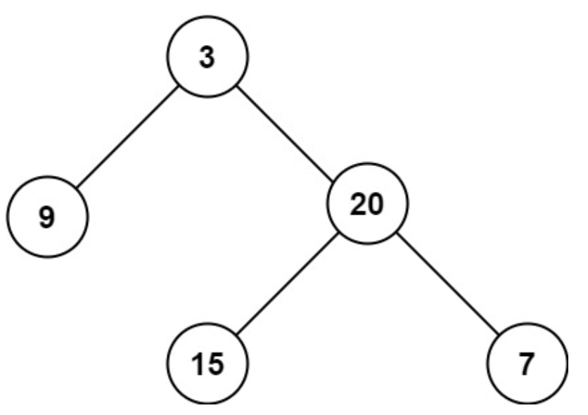

# 二叉树的最大深度
## 背景知识
二叉树的广度优先搜索（BFS）和深度优先搜索（DFS）是遍历或搜索树中节点的两种常见算法。
### 广度优先搜索（BFS）
广度优先搜索从根节点开始，首先访问根节点，然后逐层访问子节点。在访问每一层节点时，按照从左到右的顺序访问。通常使用一个队列来实现BFS。
以下是使用队列实现BFS的Python代码示例：
```python
from collections import deque
class TreeNode:
    def __init__(self, val=0, left=None, right=None):
        self.val = val
        self.left = left
        self.right = right
def bfs(root):
    if not root:
        return []
    queue = deque([root])
    result = []
    while queue:
        node = queue.popleft()
        result.append(node.val)
        if node.left:
            queue.append(node.left)
        if node.right:
            queue.append(node.right)
    return result
# 使用示例
# 构建示例1中的二叉树
root1 = TreeNode(3)
root1.left = TreeNode(9)
root1.right = TreeNode(20, TreeNode(15), TreeNode(7))
# 执行BFS
print(bfs(root1))  # 输出应为 [3, 9, 20, 15, 7]
```
### 深度优先搜索（DFS）
深度优先搜索从根节点开始，沿着一条路径深入到不能再深入为止，然后回溯到上一个节点，沿着另一条路径深入。这个过程一直进行到所有的路径都被探索过为止。DFS可以通过递归或栈来实现。
以下是使用递归实现DFS的Python代码示例：
```python
def dfs(root):
    if not root:
        return []
    result = []
    result.append(root.val)
    result.extend(dfs(root.left))
    result.extend(dfs(root.right))
    return result
# 使用示例
# 构建示例1中的二叉树
root1 = TreeNode(3)
root1.left = TreeNode(9)
root1.right = TreeNode(20, TreeNode(15), TreeNode(7))
# 执行DFS
print(dfs(root1))  # 输出应为 [3, 9, 20, 15, 7]
```
在这个DFS的例子中，我们使用了前序遍历（根-左-右）的顺序。你还可以使用中序遍历（左-根-右）或后序遍历（左-右-根）的顺序来实现DFS。
两种搜索算法都有其用途，BFS通常用于在图中找到最短路径，而DFS则适用于遍历或搜索树的节点。

## 问题
给定一个二叉树 root ，返回其最大深度。

二叉树的 最大深度 是指从根节点到最远叶子节点的最长路径上的节点数。


示例 1：



```

输入：root = [3,9,20,null,null,15,7]
输出：3
```
示例 2：
```
输入：root = [1,null,2]
输出：2
```
## 解答
要计算二叉树的最大深度，可以使用深度优先搜索（DFS）算法。递归是一个简单而直观的方法。对于每个节点，递归地计算其左子树和右子树的最大深度，然后取两者之间的最大值，并加上当前节点的深度（1）。
以下是实现这一算法的Python代码示例：
```python
class TreeNode:
    def __init__(self, val=0, left=None, right=None):
        self.val = val
        self.left = left
        self.right = right
def maxDepth(root):
    if not root:
        return 0
    else:
        left_depth = maxDepth(root.left)
        right_depth = maxDepth(root.right)
        return max(left_depth, right_depth) + 1
# 示例使用
# 构建示例1中的二叉树
root1 = TreeNode(3)
root1.left = TreeNode(9)
root1.right = TreeNode(20, TreeNode(15), TreeNode(7))
# 构建示例2中的二叉树
root2 = TreeNode(1, None, TreeNode(2))
# 计算深度
print(maxDepth(root1))  # 输出应为3
print(maxDepth(root2))  # 输出应为2
```
在这个代码中，`TreeNode` 类定义了二叉树的节点结构，`maxDepth` 函数通过递归计算最大深度。每次递归调用处理一个节点，如果遇到空节点（`None`），则返回深度0。否则，它会计算左右子树的深度，并返回较大的深度加1（加1是因为要包括当前节点）。

