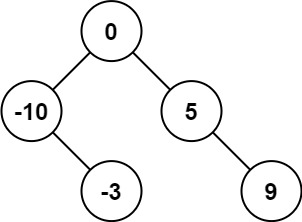

# 将有序的数组转换为二叉搜索树
## 背景知识
### 二叉搜索树
二叉搜索树（Binary Search Tree，简称BST）是一种特殊的二叉树，它满足以下性质：
1. 每个节点都有一个键（和通常一个相关的值），并且节点的键可以用于进行比较。
2. 对于任何节点`n`，左子树中的所有节点的键都小于`n`的键。
3. 对于任何节点`n`，右子树中的所有节点的键都大于`n`的键。
4. 左右子树也都是二叉搜索树。
由于这些性质，二叉搜索树提供了一种高效的查找、插入和删除操作。在二叉搜索树中进行查找操作时，可以按照以下步骤进行：
1. 从根节点开始，将待查找的键与当前节点的键进行比较。
2. 如果待查找的键小于当前节点的键，则移动到左子节点。
3. 如果待查找的键大于当前节点的键，则移动到右子节点。
4. 如果待查找的键等于当前节点的键，则查找成功。
5. 如果遇到一个空的子节点，则查找失败。
二叉搜索树的插入和删除操作也遵循类似的逻辑。插入操作时，根据键的大小找到合适的位置，并创建一个新的节点。删除操作稍微复杂一些，可能需要处理多种情况，例如删除的节点没有子节点、有一个子节点或有两个子节点。
二叉搜索树的效率在很大程度上取决于树的形状。理想情况下，树应该大致平衡，这样操作的时间复杂度接近O(log n)，其中n是树中节点的数量。如果树高度不平衡，最坏情况下操作的时间复杂度可能退化到O(n)。因此，为了保持高效的性能，通常会使用各种平衡二叉搜索树，如AVL树、红黑树等。

### 平衡二叉搜索树
平衡二叉搜索树（Balanced Binary Search Tree，简称BBST）是一种特殊的二叉搜索树（Binary Search Tree，简称BST），它在二叉搜索树的基础上增加了平衡性的要求。平衡性指的是树中任意节点的左右子树的高度差（也称为平衡因子）不超过1。
平衡二叉搜索树的优点在于能够保证树的高度大约为log(n)，其中n是树中节点的数量。这样的高度保证了二叉搜索树的基本操作（如插入、删除、查找）的时间复杂度为O(log(n))，从而提高了效率。
常见的平衡二叉搜索树有：
1. AVL树（Adelson-Velsky和Landis树）：是最早被发明的自平衡二叉搜索树，通过旋转操作（单旋转或双旋转）来维护平衡。
2. 红黑树：是一种自平衡的二叉搜索树，通过颜色的约束和旋转操作来维护平衡。红黑树中的节点被涂上红色或黑色，并通过一系列规则来保持树的平衡。
3. Treap（树堆）和伸展树（Splay Tree）：这两种树通过随机化（Treap）或通过将最近访问的节点移动到树的根部（伸展树）来维护平衡。
平衡二叉搜索树在计算机科学中有着广泛的应用，例如在数据库索引、优先队列（通过二叉堆实现）和符号表等数据结构中。

## 问题
给你一个整数数组 nums ，其中元素已经按 升序 排列，请你将其转换为一棵
平衡
 二叉搜索树。


示例 1：


```
输入：nums = [-10,-3,0,5,9]
输出：[0,-3,9,-10,null,5]
解释：[0,-10,5,null,-3,null,9] 也将被视为正确答案：
```


示例 2：


```
输入：nums = [1,3]
输出：[3,1]
解释：[1,null,3] 和 [3,1] 都是高度平衡二叉搜索树。
```
## 解答
为了将一个升序数组转换为平衡的二叉搜索树，我们可以采用递归的方法。由于数组已经是有序的，我们可以每次选择中间的元素作为当前子树的根节点，这样左右子树的元素数量就会尽可能相等，从而保证树是平衡的。
以下是具体的步骤：
1. 找到数组中间的元素，将其作为当前子树的根节点。
2. 递归地在中间元素的左侧构建左子树。
3. 递归地在中间元素的右侧构建右子树。
4. 将构建好的左子树和右子树分别连接到根节点上。
在Python中，我们可以这样实现：
```python
class TreeNode:
    def __init__(self, val=0, left=None, right=None):
        self.val = val
        self.left = left
        self.right = right
def sortedArrayToBST(nums):
    if not nums:
        return None
    mid = len(nums) // 2
    # 创建根节点
    root = TreeNode(nums[mid])
    # 递归构建左子树和右子树
    root.left = sortedArrayToBST(nums[:mid])
    root.right = sortedArrayToBST(nums[mid+1:])
    return root
# 示例使用
nums1 = [-10, -3, 0, 5, 9]
nums2 = [1, 3]
# 构建二叉搜索树
bst1 = sortedArrayToBST(nums1)
bst2 = sortedArrayToBST(nums2)
# 打印二叉搜索树（以层序遍历的方式）
def print_tree(root):
    if not root:
        print("[]")
        return
    queue = deque([root])
    result = []
    while queue:
        level = []
        for _ in range(len(queue)):
            node = queue.popleft()
            if node:
                level.append(node.val)
                queue.append(node.left)
                queue.append(node.right)
            else:
                level.append(None)
        if any(val is not None for val in level):
            result.append(level)
    print(result)
print_tree(bst1)  # 输出: [[0], [-10, 5], [None, -3, None, 9]]
print_tree(bst2)  # 输出: [[3], [1]]
```
在这个实现中，`sortedArrayToBST`函数接受一个升序数组`nums`，并返回一个平衡的二叉搜索树的根节点。函数首先检查数组是否为空，然后找到中间位置的索引`mid`，并创建一个以`nums[mid]`为值的根节点。接着，函数递归地在数组的左半部分和右半部分分别构建左子树和右子树，并将它们分别连接到根节点的左侧和右侧。最后，返回根节点。
`print_tree`函数用于以层序遍历的方式打印二叉树，以便于验证结果。在实际应用中，你可能不需要这个打印函数，而是直接使用返回的`TreeNode`对象。


