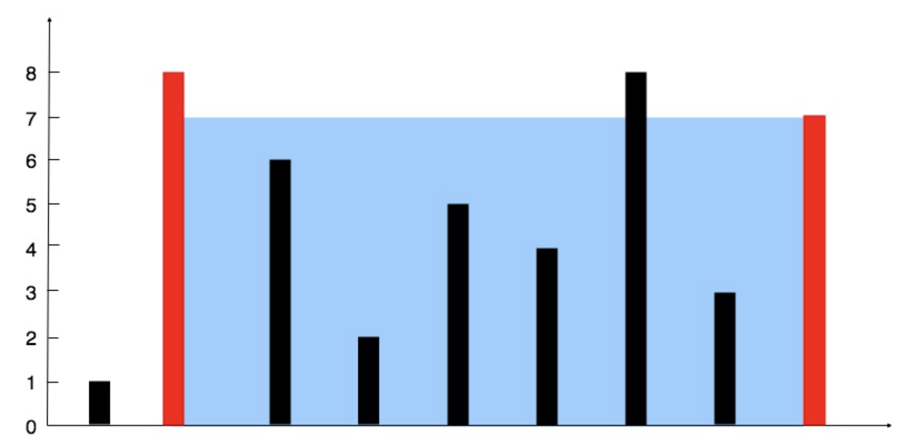

# 盛水最多的容器
## 问题
给定一个长度为 n 的整数数组 height 。有 n 条垂线，第 i 条线的两个端点是 (i, 0) 和 (i, height[i]) 。

找出其中的两条线，使得它们与 x 轴共同构成的容器可以容纳最多的水。

返回容器可以储存的最大水量。

说明：你不能倾斜容器。
示例1：

```
输入：[1,8,6,2,5,4,8,3,7]
输出：49 
解释：图中垂直线代表输入数组 [1,8,6,2,5,4,8,3,7]。在此情况下，容器能够容纳水（表示为蓝色部分）的最大值为 49。

```
示例 2：
```
输入：height = [1,1]
输出：1
```

## 解答
class Solution:
    def maxArea(self, height: List[int]) -> int:
        # 初始化左右指针和最大面积
        left, right = 0, len(height) - 1
        max_water = 0

        # 当左指针小于右指针时继续
        while left < right:
            # 计算当前面积，更新最大面积
            current_water = (right - left) * min(height[left], height[right])
            max_water = max(max_water, current_water)

            # 移动较短的线段指针
            if height[left] < height[right]:
                left += 1
            else:
                right -= 1

        return max_water
