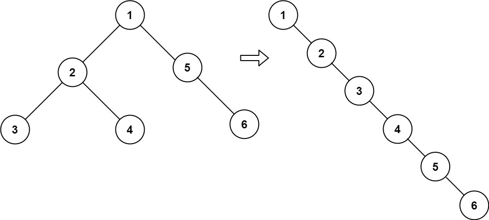

# 二叉树展开为链表
## 问题
给你二叉树的根结点 root ，请你将它展开为一个单链表：

展开后的单链表应该同样使用 TreeNode ，其中 right 子指针指向链表中下一个结点，而左子指针始终为 null 。
展开后的单链表应该与二叉树 先序遍历 顺序相同。


示例 1：


```
输入：root = [1,2,5,3,4,null,6]
输出：[1,null,2,null,3,null,4,null,5,null,6]
```
示例 2：
```
输入：root = []
输出：[]
```
示例 3：
```
输入：root = [0]
输出：[0]
```
## 解答
为了将二叉树展开为单链表，我们可以按照先序遍历的顺序访问每个节点，并在访问时修改节点的左右子指针。具体步骤如下：
1. 访问当前节点，并将其添加到单链表的末尾。
2. 将当前节点的左子节点设置为 null。
3. 将当前节点的右子节点添加到单链表的末尾。
4. 递归地按照上述步骤处理当前节点的左子树和右子树。
以下是具体的步骤：
1. 创建一个辅助函数 `flatten`，该函数接受二叉树的根节点 `root`。
2. 在 `flatten` 函数中，首先检查 `root` 是否为空。如果是，则返回。
3. 创建一个辅助列表 `nodes`，用于存储待处理的节点。
4. 将 `root` 添加到 `nodes` 列表中。
5. 进入一个循环，直到 `nodes` 列表为空。
   - 从 `nodes` 列表中取出一个节点 `node`。
   - 将 `node` 的右子节点添加到 `nodes` 列表中。
   - 将 `node` 的左子节点设置为 null。
   - 将 `node` 的右子节点设置为其前一个节点的右子节点。
   - 如果有更多的节点待处理，则将 `node` 的下一个节点添加到 `nodes` 列表中。
6. 返回 `root`。
在Python中，我们可以这样实现：
```python
class TreeNode:
    def __init__(self, val=0, left=None, right=None):
        self.val = val
        self.left = left
        self.right = right
def flatten(root: TreeNode) -> None:
    if not root:
        return

    nodes = [root]
    while nodes:
        node = nodes.pop()
        if node.right:
            nodes.append(node.right)
        if node.left:
            nodes.append(node.left)
        if nodes:
            node.right = nodes[-1]
        node.left = None
# 示例使用
root1 = TreeNode(1, TreeNode(2, TreeNode(4)), TreeNode(3, None, TreeNode(5)))
flatten(root1)
# 验证结果
def print_tree(root):
    if not root:
        return
    print(root.val, end=' ')
    print_tree(root.right)
    print_tree(root.left)
print_tree(root1)  # 输出: 1 4 5 2 3
```
在这个实现中，我们使用了一个辅助函数 `flatten` 来修改二叉树的结构，使其成为一个单链表。然后，我们使用另一个辅助函数 `print_tree` 来验证结果。这个函数按照先序遍历的顺序打印树中的所有节点。

