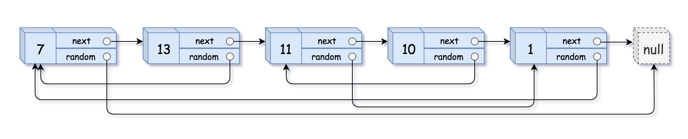

# 随机链表的复制
## 问题
给你一个长度为 n 的链表，每个节点包含一个额外增加的随机指针 random ，该指针可以指向链表中的任何节点或空节点。

构造这个链表的 深拷贝。 深拷贝应该正好由 n 个 全新 节点组成，其中每个新节点的值都设为其对应的原节点的值。新节点的 next 指针和 random 指针也都应指向复制链表中的新节点，并使原链表和复制链表中的这些指针能够表示相同的链表状态。复制链表中的指针都不应指向原链表中的节点 。

例如，如果原链表中有 X 和 Y 两个节点，其中 X.random --> Y 。那么在复制链表中对应的两个节点 x 和 y ，同样有 x.random --> y 。

返回复制链表的头节点。

用一个由 n 个节点组成的链表来表示输入/输出中的链表。每个节点用一个 [val, random_index] 表示：

val：一个表示 Node.val 的整数。
random_index：随机指针指向的节点索引（范围从 0 到 n-1）；如果不指向任何节点，则为  null 。
你的代码 只 接受原链表的头节点 head 作为传入参数。


示例 1：


```
输入：head = [[7,null],[13,0],[11,4],[10,2],[1,0]]
输出：[[7,null],[13,0],[11,4],[10,2],[1,0]]
```
示例 2：


```
输入：head = [[1,1],[2,1]]
输出：[[1,1],[2,1]]
```
示例 3：

```

输入：head = [[3,null],[3,0],[3,null]]
输出：[[3,null],[3,0],[3,null]]
```
## 答案
为了实现链表的深拷贝，我们可以遵循以下步骤：
1. **复制每个节点**：遍历原始链表，对于每个节点创建其副本，并将副本插入到原节点和下一个节点之间。例如，原始链表为 A -> B -> C，则变为 A -> A' -> B -> B' -> C -> C'，其中 A', B', C' 是新复制的节点。
2. **复制随机指针**：再次遍历链表，这次设置每个复制节点的随机指针。由于复制节点紧跟在原节点之后，我们可以轻松地访问到原节点的随机指针所指向的节点，然后设置复制节点的随机指针指向相应的复制节点。
3. **拆分链表**：最后，将原始链表和复制链表分离。遍历链表，将每个复制节点从原始链表中分离出来，同时恢复原始链表的原始状态。
以下是这个算法的 Python 代码实现：
```python
class Solution:
    def copyRandomList(self, head: 'Node') -> 'Node':
        if not head:
            return None
        # Step 1: Copy each node and insert it to the list
        current = head
        while current:
            next_node = current.next
            copy_node = Node(current.val, None, None)
            current.next = copy_node
            copy_node.next = next_node
            current = next_node
        # Step 2: Copy random pointers for each copied node
        current = head
        while current:
            if current.random:
                current.next.random = current.random.next
            current = current.next.next
        # Step 3: Separate the copied list from the original list
        current = head
        copy_head = head.next
        while current:
            copy_node = current.next
            current.next = copy_node.next
            current = current.next
            if current:
                copy_node.next = current.next
        return copy_head
```
在这个实现中，我们首先复制每个节点并插入到原节点之后，然后设置复制节点的随机指针，最后将复制节点从原链表中分离出来，形成一个新的链表。这样我们就得到了一个深拷贝的链表。

