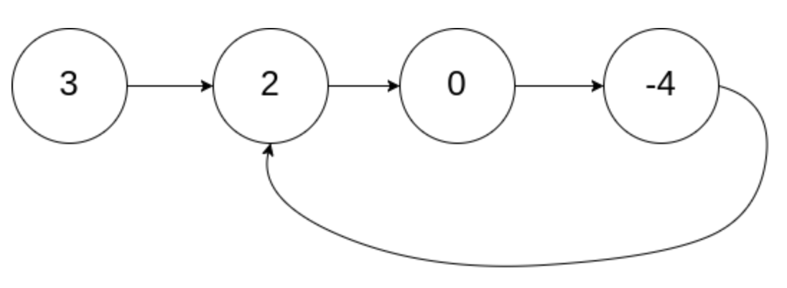
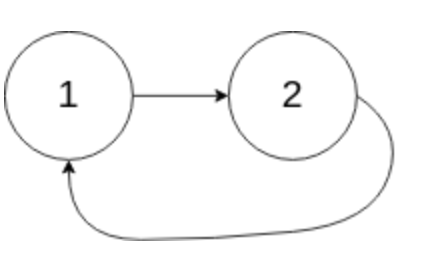
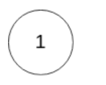

# 环形链表
## 问题
给你一个链表的头节点 head ，判断链表中是否有环。

如果链表中有某个节点，可以通过连续跟踪 next 指针再次到达，则链表中存在环。 为了表示给定链表中的环，评测系统内部使用整数 pos 来表示链表尾连接到链表中的位置（索引从 0 开始）。注意：pos 不作为参数进行传递 。仅仅是为了标识链表的实际情况。

如果链表中存在环 ，则返回 true 。 否则，返回 false 。


示例 1：



```
输入：head = [3,2,0,-4], pos = 1
输出：true
解释：链表中有一个环，其尾部连接到第二个节点。
```
示例 2：


```
输入：head = [1,2], pos = 0
输出：true
解释：链表中有一个环，其尾部连接到第一个节点。
```
示例 3：


```
输入：head = [1], pos = -1
输出：false
解释：链表中没有环。
```
## 解答
要判断链表中是否有环，可以使用“快慢指针”的算法。这个算法初始化两个指针，一个快指针一个慢指针。在开始时，两个指针都位于链表的头节点，然后慢指针每次移动一步，而快指针每次移动两步。如果在移动过程中快指针追上了慢指针，那么链表中存在环；如果快指针到达了链表的末尾（即快指针的下一个节点或下下个节点为空），则链表中没有环。
以下是这个算法的Python代码实现：
```python
class ListNode:
    def __init__(self, x):
        self.val = x
        self.next = None
def hasCycle(head: ListNode) -> bool:
    if head is None or head.next is None:
        return False
    slow = head
    fast = head.next
    while slow != fast:
        if fast is None or fast.next is None:
            return False
        slow = slow.next
        fast = fast.next.next
    return True
# 示例使用
# 创建链表 [3,2,0,-4]，并使其成环
node1 = ListNode(3)
node2 = ListNode(2)
node3 = ListNode(0)
node4 = ListNode(-4)
node1.next = node2
node2.next = node3
node3.next = node4
node4.next = node2  # 形成环
print(hasCycle(node1))  # 输出应为 True
```
在这个实现中，`ListNode` 是链表节点的定义，`hasCycle` 函数接受链表的头节点 `head` 作为参数，并返回一个布尔值，指示链表是否包含环。在实际应用中，链表的创建和环的连接将根据具体情况来确定。上述代码中的示例链表是按照第一个示例创建的，并手动连接成环。在实际的面试或编程问题中，通常会提供链表的创建逻辑，而不会要求测试者手动创建链表和环。

