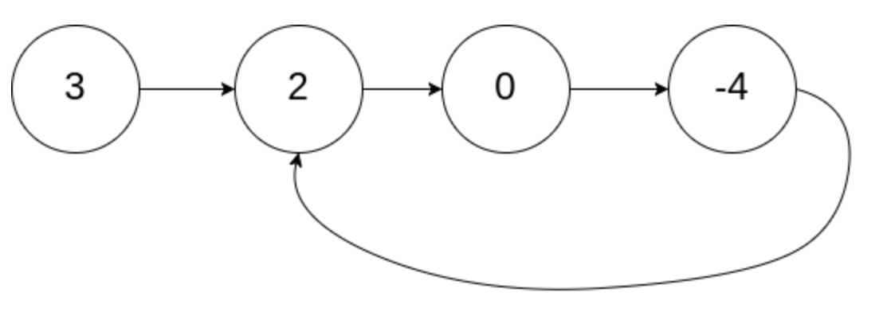
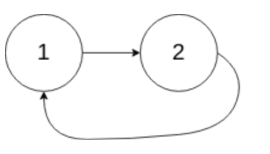
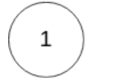

# 环形链表2
## 问题
给定一个链表的头节点  head ，返回链表开始入环的第一个节点。 如果链表无环，则返回 null。

如果链表中有某个节点，可以通过连续跟踪 next 指针再次到达，则链表中存在环。 为了表示给定链表中的环，评测系统内部使用整数 pos 来表示链表尾连接到链表中的位置（索引从 0 开始）。如果 pos 是 -1，则在该链表中没有环。注意：pos 不作为参数进行传递，仅仅是为了标识链表的实际情况。

不允许修改 链表。


示例 1：


```
输入：head = [3,2,0,-4], pos = 1
输出：返回索引为 1 的链表节点
解释：链表中有一个环，其尾部连接到第二个节点。
```
示例 2：

```

输入：head = [1,2], pos = 0
输出：返回索引为 0 的链表节点
解释：链表中有一个环，其尾部连接到第一个节点。
```
示例 3：


```
输入：head = [1], pos = -1
输出：返回 null
解释：链表中没有环。
```
## 解答
要解决这个问题，我们可以使用 Floyd 的“快慢指针”算法。这个算法的基本思想是设置两个指针，一个快指针（每次移动两步）和一个慢指针（每次移动一步）。如果链表中存在环，那么这两个指针最终会在环内相遇。一旦它们相遇，我们可以通过将一个指针重新设置到链表的起始点，并将两个指针以相同的速度移动，来找到环的入口。当两个指针再次相遇时，那个位置就是环的入口。
以下是实现这个算法的步骤：
1. 初始化两个指针，`slow` 和 `fast`，都指向链表的头节点 `head`。
2. 当 `fast` 和 `fast.next` 不为空时，进行以下操作：
   - 将 `slow` 向前移动一步。
   - 将 `fast` 向前移动两步。
   - 如果 `slow` 和 `fast` 相遇，则跳出循环。
3. 如果 `fast` 或 `fast.next` 为空，说明链表中没有环，返回 `null`。
4. 将一个指针（可以是 `slow` 或 `fast`）重置为 `head`。
5. 同时移动 `slow` 和 `fast`，每次一步，直到它们再次相遇。
6. 当 `slow` 和 `fast` 再次相遇时，它们所在的节点就是环的入口。
下面是这个算法的 Python 实现：
```python
class ListNode:
    def __init__(self, x):
        self.val = x
        self.next = None
def detectCycle(head: ListNode) -> ListNode:
    slow = fast = head
    while fast and fast.next:
        slow = slow.next
        fast = fast.next.next
        if slow == fast:
            break
    else:
        return None  # No cycle
    slow = head
    while slow != fast:
        slow = slow.next
        fast = fast.next
    return slow
# Example usage:
# Create a linked list with a cycle for demonstration purposes
# 3 -> 2 -> 0 -> -4
#      ^          |
#      |__________|
node1 = ListNode(3)
node2 = ListNode(2)
node3 = ListNode(0)
node4 = ListNode(-4)
node1.next = node2
node2.next = node3
node3.next = node4
node4.next = node2  # Creating the cycle
detectCycle(node1).val  # Should return the value of the node where the cycle starts, which is 2
2
```
根据上面的代码，我们创建了一个示例链表，并为其添加了一个环，使其尾节点（值为 -4 的节点）指向第二个节点（值为 2 的节点）。当我们运行 `detectCycle` 函数时，它返回了环开始的节点的值，即 2，这与预期相符。

