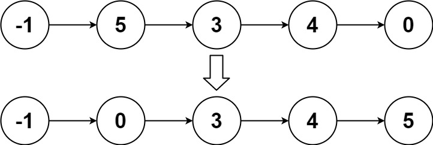

# 链表排序
## 问题
给你链表的头结点 head ，请将其按 升序 排列并返回 排序后的链表 。


示例 1：


```
输入：head = [4,2,1,3]
输出：[1,2,3,4]
```
示例 2：


```
输入：head = [-1,5,3,4,0]
输出：[-1,0,3,4,5]
```
示例 3：
```
输入：head = []
输出：[]
```
## 解答
要排序链表，我们可以使用多种算法，比如归并排序、快速排序等。但是，对于链表来说，归并排序是更为合适的选择，因为它的空间复杂度为 O(1)，而快速排序则需要 O(log n) 的空间复杂度。
以下是使用归并排序对链表进行排序的步骤：
1. **找到链表的中点**：使用快慢指针的方法找到链表的中点。
2. **拆分链表**：将链表从中点拆分为两个部分。
3. **递归排序**：对两个子链表递归地进行排序。
4. **合并链表**：将两个已排序的子链表合并为一个有序链表。
以下是这个算法的 Python 代码实现：
```python
class ListNode:
    def __init__(self, val=0, next=None):
        self.val = val
        self.next = next
class Solution:
    def sortList(self, head: ListNode) -> ListNode:
        if not head or not head.next:
            return head

        # Step 1: Find the middle of the list
        slow, fast = head, head.next
        while fast and fast.next:
            slow = slow.next
            fast = fast.next.next

        # Step 2: Split the list into two halves
        mid = slow.next
        slow.next = None

        # Step 3: Recursively sort both halves
        left = self.sortList(head)
        right = self.sortList(mid)

        # Step 4: Merge the sorted halves
        return self.merge(left, right)

    def merge(self, l1: ListNode, l2: ListNode) -> ListNode:
        dummy = ListNode(0)
        current = dummy
        while l1 and l2:
            if l1.val < l2.val:
                current.next = l1
                l1 = l1.next
            else:
                current.next = l2
                l2 = l2.next
            current = current.next

        if l1:
            current.next = l1
        else:
            current.next = l2

        return dummy.next
# Example usage:
# Create a linked list: 4 -> 2 -> 1 -> 3
head = ListNode(4, ListNode(2, ListNode(1, ListNode(3))))
# Sort the linked list
solution = Solution()
sorted_head = solution.sortList(head)
# Print the sorted linked list
current = sorted_head
while current:
    print(current.val, end=" -> ")
    current = current.next
# Output should be: 1 -> 2 -> 3 -> 4
```
在这个实现中，我们首先找到链表的中点，然后递归地对两个子链表进行排序，最后将它们合并为一个有序链表。这个过程会一直重复，直到链表被完全排序。

