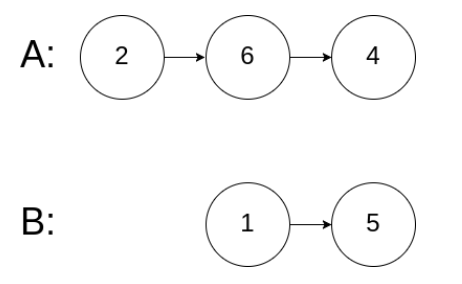

# 相交链表
## 问题
给你两个单链表的头节点 headA 和 headB ，请你找出并返回两个单链表相交的起始节点。如果两个链表不存在相交节点，返回 null 。

图示两个链表在节点 c1 开始相交：


题目数据 保证 整个链式结构中不存在环。

注意，函数返回结果后，链表必须 保持其原始结构 。

自定义评测：

评测系统 的输入如下（你设计的程序 不适用 此输入）：

- `intersectVal` - 相交的起始节点的值。如果不存在相交节点，这一值为 `0`
- `listA` - 第一个链表
- `listB` - 第二个链表
- `skipA` - 在 `listA` 中（从头节点开始）跳到交叉节点的节点数
- `skipB` - 在 `listB` 中（从头节点开始）跳到交叉节点的节点数
评测系统将根据这些输入创建链式数据结构，并将两个头节点 headA 和 headB 传递给你的程序。如果程序能够正确返回相交节点，那么你的解决方案将被 视作正确答案 。


示例 1：


```
输入：intersectVal = 8, listA = [4,1,8,4,5], listB = [5,6,1,8,4,5], skipA = 2, skipB = 3
输出：Intersected at '8'
解释：相交节点的值为 8 （注意，如果两个链表相交则不能为 0）。
从各自的表头开始算起，链表 A 为 [4,1,8,4,5]，链表 B 为 [5,6,1,8,4,5]。
在 A 中，相交节点前有 2 个节点；在 B 中，相交节点前有 3 个节点。
— 请注意相交节点的值不为 1，因为在链表 A 和链表 B 之中值为 1 的节点 (A 中第二个节点和 B 中第三个节点) 是不同的节点。换句话说，它们在内存中指向两个不同的位置，而链表 A 和链表 B 中值为 8 的节点 (A 中第三个节点，B 中第四个节点) 在内存中指向相同的位置。
```

示例 2：


```
输入：intersectVal = 2, listA = [1,9,1,2,4], listB = [3,2,4], skipA = 3, skipB = 1
输出：Intersected at '2'
解释：相交节点的值为 2 （注意，如果两个链表相交则不能为 0）。
从各自的表头开始算起，链表 A 为 [1,9,1,2,4]，链表 B 为 [3,2,4]。
在 A 中，相交节点前有 3 个节点；在 B 中，相交节点前有 1 个节点。
```
示例 3：


```
输入：intersectVal = 0, listA = [2,6,4], listB = [1,5], skipA = 3, skipB = 2
输出：null
解释：从各自的表头开始算起，链表 A 为 [2,6,4]，链表 B 为 [1,5]。
由于这两个链表不相交，所以 intersectVal 必须为 0，而 skipA 和 skipB 可以是任意值。
这两个链表不相交，因此返回 null 。
```
## 解答
要找到两个链表的相交点，可以使用“双指针”方法。这个方法的基本思想是让两个指针分别遍历两个链表，当一个指针遍历完一个链表后，跳到另一个链表的头部继续遍历，另一个指针也是如此。这样，两个指针就会在相交点相遇。
以下是 Python 代码实现：
```python
class ListNode:
    def __init__(self, x):
        self.val = x
        self.next = None
def getIntersectionNode(headA, headB):
    if not headA or not headB:
        return None
    
    pointerA, pointerB = headA, headB
    
    while pointerA is not pointerB:
        pointerA = pointerA.next if pointerA else headB
        pointerB = pointerB.next if pointerB else headA
    
    return pointerA
# 示例 1
# 构建链表 A 和 B
A = ListNode(4)
A.next = ListNode(1)
A.next.next = ListNode(8)
A.next.next.next = ListNode(4)
A.next.next.next.next = ListNode(5)
B = ListNode(5)
B.next = ListNode(6)
B.next.next = ListNode(1)
B.next.next.next = A.next.next  # 设置相交点
# 调用函数
print(getIntersectionNode(A, B).val)  # 输出：8
```
在这个代码中，`ListNode` 类是链表节点的定义，`getIntersectionNode` 函数接收两个链表的头节点 `headA` 和 `headB`，并返回相交节点的值。如果两个链表不相交，则返回 `None`。
在 while 循环中，两个指针 `pointerA` 和 `pointerB` 分别在两个链表上移动。当 `pointerA` 到达链表 A 的末尾时，它跳到链表 B 的头部；同样，当 `pointerB` 到达链表 B 的末尾时，它跳到链表 A 的头部。如果两个链表相交，那么两个指针最终会在相交点相遇。
这个算法的时间复杂度是 O(a + b)，其中 a 和 b 分别是两个链表的长度。因为每个指针最多遍历两个链表各一次。空间复杂度是 O(1)，因为只使用了常数级别的额外空间。

