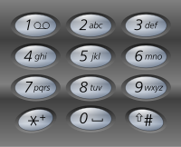

# 电话号码的字母组合
## 问题
给定一个仅包含数字 2-9 的字符串，返回所有它能表示的字母组合。答案可以按 任意顺序 返回。

给出数字到字母的映射如下（与电话按键相同）。注意 1 不对应任何字母。





示例 1：
```
输入：digits = "23"
输出：["ad","ae","af","bd","be","bf","cd","ce","cf"]
```
示例 2：
```
输入：digits = ""
输出：[]
```
示例 3：
```
输入：digits = "2"
输出：["a","b","c"]
```

## 解答
要解决这个问题，我们可以使用回溯算法。回溯算法是一种通过探索所有可能的候选解来找出所有的解的算法。对于这个问题，我们可以将每个数字对应的字母看作是一个选择，然后递归地构建所有可能的字母组合。
以下是使用Python实现的回溯算法来解决这个问题的代码示例：
```python
def letterCombinations(digits):
    if not digits:
        return []
    # 创建数字到字母的映射
    phone = {
        '2': 'abc',
        '3': 'def',
        '4': 'ghi',
        '5': 'jkl',
        '6': 'mno',
        '7': 'pqrs',
        '8': 'tuv',
        '9': 'wxyz'
    }
    def backtrack(index, path):
        # 如果路径长度等于数字长度，说明一个组合完成
        if len(path) == len(digits):
            output.append(''.join(path))
            return
        # 获取当前数字对应的字母
        for letter in phone[digits[index]]:
            # 选择当前字母，加入到路径中
            path.append(letter)
            # 递归调用，处理下一个数字
            backtrack(index + 1, path)
            # 回溯，撤销选择
            path.pop()

    output = []
    backtrack(0, [])
    return output
# 示例
digits = "23"
print(letterCombinations(digits))
```
这段代码定义了一个内部函数 `backtrack`，它负责执行回溯操作。对于字符串 `digits` 中的每个数字，我们将其对应的每个字母都加入到当前路径中，并递归地处理下一个数字。每次递归调用后，我们都会通过撤销最后的选择来回到上一步的状态，这就是回溯的过程。
`letterCombinations` 函数初始化一个空列表 `output` 来存储所有的字母组合，然后调用 `backtrack` 函数来生成这些组合。最后，函数返回这个列表作为结果。由于每个数字都对应了多个字母，因此最终会有 `3^n` 个组合，其中 `n` 是字符串 `digits` 的长度（这里假设每个数字都对应3个字母，实际上数字7对应4个字母，但这不影响算法的逻辑）。

