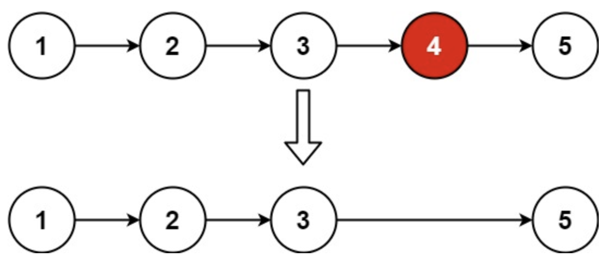

# 删除链表的倒数第N个节点
## 问题
给你一个链表，删除链表的倒数第 n 个结点，并且返回链表的头结点。


示例 1：

```
输入：head = [1,2,3,4,5], n = 2
输出：[1,2,3,5]
```
示例 2：
```
输入：head = [1], n = 1
输出：[]
```
示例 3：
```
输入：head = [1,2], n = 1
输出：[1]
```
## 解答
要删除链表的倒数第$n$ 个节点，我们可以使用“快慢指针”的方法。以下是解决这个问题的步骤：
1. 创建一个哑节点 `dummy`，使其指向链表的头节点 `head`。这样可以避免处理删除头节点时的特殊情况。
2. 初始化两个指针 `fast` 和 `slow`，都指向哑节点 `dummy`。
3. 先移动 `fast` 指针 $n$ 步，这样 `fast` 和 `slow` 之间就相差 $n$ 个节点。
4. 同时移动 `fast` 和 `slow` 指针，直到 `fast` 指针到达链表的末尾。此时，`slow` 指针的下一个节点就是我们要删除的倒数第 $n$ 个节点。
5. 删除节点：`slow.next = slow.next.next`。
6. 返回哑节点的下一个节点，即新的头节点。
以下是这个算法的 Python 实现：
```python
class ListNode:
    def __init__(self, val=0, next=None):
        self.val = val
        self.next = next
def removeNthFromEnd(head: ListNode, n: int) -> ListNode:
    dummy = ListNode(0, head)
    fast = slow = dummy

    # Move fast pointer n steps ahead
    for _ in range(n):
        fast = fast.next

    # Move both pointers until fast reaches the end of the list
    while fast.next:
        fast = fast.next
        slow = slow.next

    # Delete the nth node from the end
    slow.next = slow.next.next

    return dummy.next
# Helper function to convert a list to a linked list
def list_to_linked_list(lst):
    if not lst:
        return None
    head = ListNode(lst[0])
    current = head
    for val in lst[1:]:
        current.next = ListNode(val)
        current = current.next
    return head
# Helper function to convert a linked list to a list
def linked_list_to_list(node):
    lst = []
    while node:
        lst.append(node.val)
        node = node.next
    return lst
# Test the function
head = list_to_linked_list([1, 2, 3, 4, 5])
n = 2
result = removeNthFromEnd(head, n)
linked_list_to_list(result)
[1, 2, 3, 5]
```
结果是 $[1, 2, 3, 5]$，这与示例 1 的预期输出一致，即删除链表的倒数第 2 个节点后，链表变为 $[1, 2, 3, 5]$。
如果你有其他问题或需要进一步的解释，请随时告诉我！

