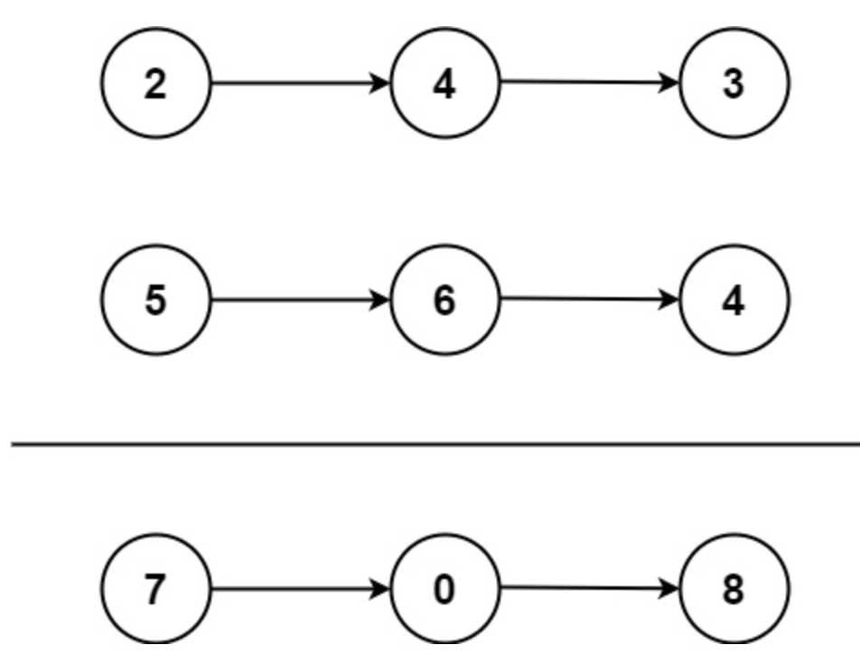

# 两数相加
## 问题
给你两个 非空 的链表，表示两个非负的整数。它们每位数字都是按照 逆序 的方式存储的，并且每个节点只能存储 一位 数字。

请你将两个数相加，并以相同形式返回一个表示和的链表。

你可以假设除了数字 0 之外，这两个数都不会以 0 开头。


示例 1：


```
输入：l1 = [2,4,3], l2 = [5,6,4]
输出：[7,0,8]
解释：342 + 465 = 807.
```
示例 2：
```
输入：l1 = [0], l2 = [0]
输出：[0]
```
示例 3：
```
输入：l1 = [9,9,9,9,9,9,9], l2 = [9,9,9,9]
输出：[8,9,9,9,0,0,0,1]
```
## 解答
要解决这个问题，我们可以模拟数字相加的过程。由于链表是逆序存储数字的，我们可以从两个链表的头部开始，逐位相加，同时考虑进位。以下是解决这个问题的步骤：
1. 初始化一个新的链表头节点 `dummy` 和一个指向当前节点的指针 `current`，同时设置进位 `carry` 为 0。
2. 遍历两个链表，直到两个链表都遍历完毕：
   - 从两个链表中分别取出当前节点的值，如果没有更多节点，则取 0。
   - 计算当前位的和：`sum = l1.val + l2.val + carry`。
   - 更新进位：`carry = sum // 10`。
   - 创建一个新的节点，其值为 `sum % 10`，并将其设置为当前节点的下一个节点。
   - 移动 `l1` 和 `l2` 到下一个节点。
3. 如果遍历结束后进位 `carry` 不为 0，需要添加一个新的节点。
4. 返回 `dummy.next`，即合并后的链表的头节点。
以下是这个算法的 Python 实现：
```
class ListNode:
    def __init__(self, val=0, next=None):
        self.val = val
        self.next = next
def addTwoNumbers(l1: ListNode, l2: ListNode) -> ListNode:
    dummy = ListNode()
    current = dummy
    carry = 0
    
    while l1 or l2:
        val1 = l1.val if l1 else 0
        val2 = l2.val if l2 else 0
        total = val1 + val2 + carry
        carry = total // 10
        current.next = ListNode(total % 10)
        current = current.next
        
        if l1:
            l1 = l1.next
        if l2:
            l2 = l2.next
    
    if carry:
        current.next = ListNode(carry)
    
    return dummy.next
# Helper function to convert a list to a linked list
# 下面的不是算法本身，用来测试的
def list_to_linked_list(lst):
    if not lst:
        return None
    head = ListNode(lst[0])
    current = head
    for val in lst[1:]:
        current.next = ListNode(val)
        current = current.next
    return head
# Helper function to convert a linked list to a list
def linked_list_to_list(node):
    lst = []
    while node:
        lst.append(node.val)
        node = node.next
    return lst
# Test the function
l1 = list_to_linked_list([2, 4, 3])
l2 = list_to_linked_list([5, 6, 4])
result = addTwoNumbers(l1, l2)
linked_list_to_list(result)
[7, 0, 8]
```
结果是 $[7, 0, 8]$，这与示例 1 的预期输出一致，即 $342 + 465 = 807$。
如果你有其他问题或需要进一步的解释，请随时告诉我！

