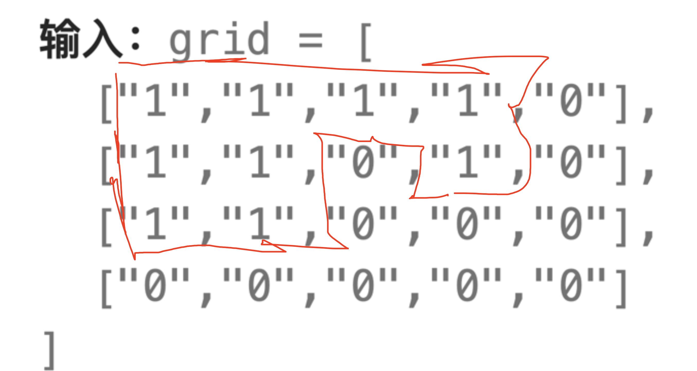
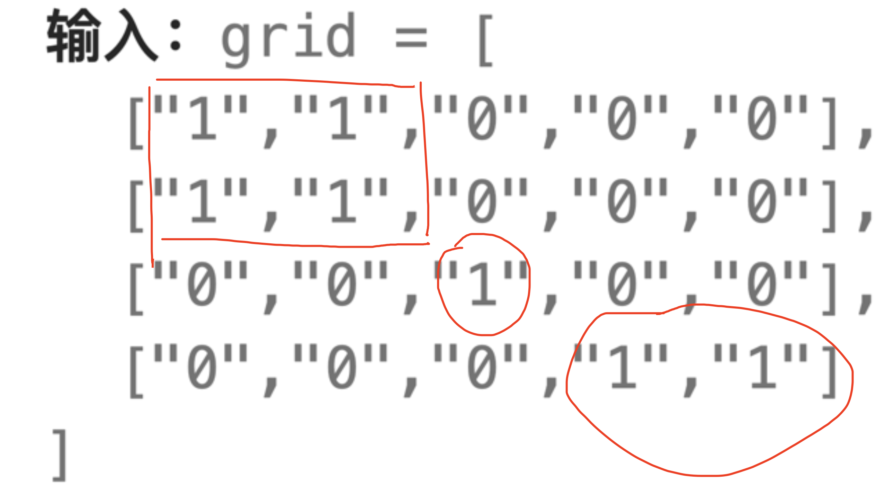

# 岛屿数量
## 问题
给你一个由 '1'（陆地）和 '0'（水）组成的的二维网格，请你计算网格中岛屿的数量。

岛屿总是被水包围，并且每座岛屿只能由水平方向和/或竖直方向上相邻的陆地连接形成。

此外，你可以假设该网格的四条边均被水包围。


示例 1：
```
输入：grid = [
  ["1","1","1","1","0"],
  ["1","1","0","1","0"],
  ["1","1","0","0","0"],
  ["0","0","0","0","0"]
]
输出：1
```

示例 2：
```
输入：grid = [
  ["1","1","0","0","0"],
  ["1","1","0","0","0"],
  ["0","0","1","0","0"],
  ["0","0","0","1","1"]
]
输出：3

```

## 解答
要计算网格中岛屿的数量，可以通过深度优先搜索（DFS）或广度优先搜索（BFS）来实现。在遍历网格的过程中，每当遇到一个陆地单元格（标记为 '1'），就可以通过DFS或BFS探索与之相连的所有陆地单元格，并将它们标记为已访问。每完成一次这样的探索，就找到了一个岛屿。
以下是使用DFS算法的Python代码示例：
```python
def numIslands(grid):
    if not grid:
        return 0
    num_of_islands = 0
    for i in range(len(grid)):
        for j in range(len(grid[0])):
            if grid[i][j] == '1':
                dfs(grid, i, j)
                num_of_islands += 1
    return num_of_islands
def dfs(grid, i, j):
    if i < 0 or j < 0 or i >= len(grid) or j >= len(grid[0]) or grid[i][j] != '1':
        return
    grid[i][j] = '0'  # 标记为已访问
    dfs(grid, i + 1, j)  # 向下探索
    dfs(grid, i - 1, j)  # 向上探索
    dfs(grid, i, j + 1)  # 向右探索
    dfs(grid, i, j - 1)  # 向左探索
# 示例1
grid1 = [
    ["1", "1", "1", "1", "0"],
    ["1", "1", "0", "1", "0"],
    ["1", "1", "0", "0", "0"],
    ["0", "0", "0", "0", "0"]
]
print(numIslands(grid1))  # 输出应为1
# 示例2
grid2 = [
    ["1", "1", "0", "0", "0"],
    ["1", "1", "0", "0", "0"],
    ["0", "0", "1", "0", "0"],
    ["0", "0", "0", "1", "1"]
]
print(numIslands(grid2))  # 输出应为3
```
这段代码首先定义了一个 `numIslands` 函数来计算岛屿的数量，然后在其中使用嵌套循环遍历整个网格。每当遇到一个未被访问的陆地单元格时，就调用 `dfs` 函数进行深度优先搜索，并将搜索过的陆地单元格标记为 '0'，表示已访问。每调用一次 `dfs`，就意味着找到了一个岛屿，因此 `num_of_islands` 计数器增加1。最后返回 `num_of_islands` 作为岛屿的数量。

