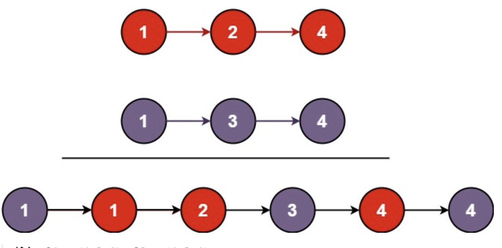

# 合并两个有序链表
## 问题
将两个升序链表合并为一个新的 升序 链表并返回。新链表是通过拼接给定的两个链表的所有节点组成的。


示例 1：

```
输入：l1 = [1,2,4], l2 = [1,3,4]
输出：[1,1,2,3,4,4]
```
示例 2：

```
输入：l1 = [], l2 = []
输出：[]
```
示例 3：
```
输入：l1 = [], l2 = [0]
输出：[0]
```
## 解答
要合并两个升序链表，我们可以使用递归或迭代的方法。以下是使用递归方法的一个简单实现：
1. 首先检查两个链表是否为空。如果其中一个链表为空，我们直接返回另一个链表。
2. 比较两个链表的头节点值，选择较小的一个作为新链表的头节点。
3. 然后递归地合并剩余的链表部分。
以下是递归方法的 Python 实现：
```
class ListNode:
    def __init__(self, val=0, next=None):
        self.val = val
        self.next = next
def mergeTwoLists(l1: ListNode, l2: ListNode) -> ListNode:
    if not l1:
        return l2
    if not l2:
        return l1
    if l1.val < l2.val:
        l1.next = mergeTwoLists(l1.next, l2)
        return l1
    else:
        l2.next = mergeTwoLists(l1, l2.next)
        return l2
# Helper function to convert a list to a linked list
def list_to_linked_list(lst):
    if not lst:
        return None
    head = ListNode(lst[0])
    current = head
    for val in lst[1:]:
        current.next = ListNode(val)
        current = current.next
    return head
# Helper function to convert a linked list to a list
def linked_list_to_list(node):
    lst = []
    while node:
        lst.append(node.val)
        node = node.next
    return lst
# Test the function
l1 = list_to_linked_list([1, 2, 4])
l2 = list_to_linked_list([1, 3, 4])
merged_list = mergeTwoLists(l1, l2)
linked_list_to_list(merged_list)
[1, 1, 2, 3, 4, 4]
```
递归方法成功地将两个升序链表 $ l1 = [1,2,4] $ 和 $ l2 = [1,3,4] $ 合并为一个新的升序链表 $ [1,1,2,3,4,4] $，这与预期结果一致。
如果你有其他问题或需要进一步的解释，请随时告诉我！

