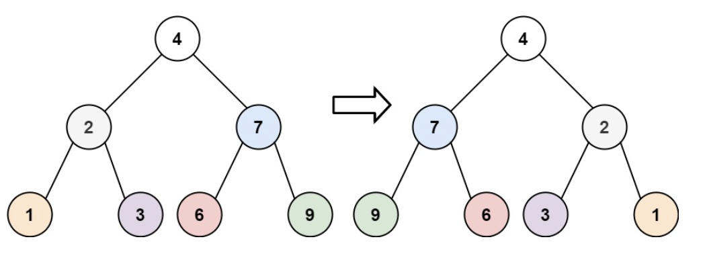
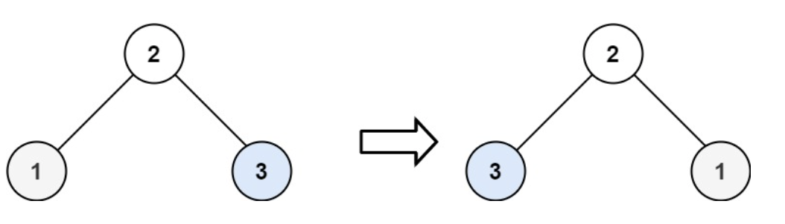

# 翻转二叉数
## 问题
给你一棵二叉树的根节点 root ，翻转这棵二叉树，并返回其根节点。


示例 1：


```
输入：root = [4,2,7,1,3,6,9]
输出：[4,7,2,9,6,3,1]
```
示例 2：


```
输入：root = [2,1,3]
输出：[2,3,1]
```
示例 3：
```
输入：root = []
输出：[]
```
## 解答
反转，只需要对每个节点的左右都反转，然后在进行整个反转即可。

翻转二叉树是一个非常经典的递归问题。基本的思路是，对于二叉树中的每一个节点，交换它的左右子节点。如果当前节点为空，则不需要进行任何操作。以下是具体的步骤：
1. 如果当前节点为空，返回 null。
2. 递归地翻转当前节点的左子树。
3. 递归地翻转当前节点的右子树。
4. 交换当前节点的左右子节点。
在Python中，可以通过定义一个递归函数来实现这一逻辑。以下是一个可能的实现：
```python
class TreeNode:
    def __init__(self, val=0, left=None, right=None):
        self.val = val
        self.left = left
        self.right = right
def invertTree(root: TreeNode) -> TreeNode:
    if not root:
        return None
    # 递归地翻转左子树
    invertTree(root.left)
    # 递归地翻转右子树
    invertTree(root.right)
    # 交换左右子节点
    root.left, root.right = root.right, root.left
    return root
```
这个函数首先检查当前节点是否为空，然后递归地调用自身以翻转左右子树，最后交换左右子节点。递归会自动处理子树的翻转，最终返回翻转后的树的根节点。

