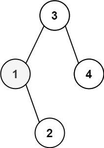
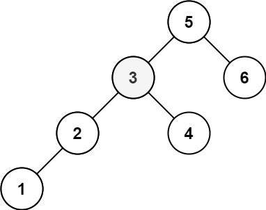

# 二叉搜索树种地K小的元素
## 问题
给定一个二叉搜索树的根节点 root ，和一个整数 k ，请你设计一个算法查找其中第 k 个最小元素（从 1 开始计数）。


示例 1：

```
输入：root = [3,1,4,null,2], k = 1
输出：1
```
示例 2：

```
输入：root = [5,3,6,2,4,null,null,1], k = 3
输出：3
```
## 解答
为了找到二叉搜索树中的第 k 个最小元素，我们可以利用二叉搜索树的性质进行中序遍历。中序遍历二叉搜索树会按照升序访问所有节点，因此我们可以按照中序遍历的顺序访问节点，直到达到第 k 个节点。
以下是具体的步骤：
1. 初始化一个计数器 `count` 为 0。
2. 进行中序遍历。
3. 在遍历过程中，每访问一个节点，就将 `count` 加 1。
4. 当 `count` 等于 k 时，当前访问的节点就是第 k 个最小元素。
在Python中，我们可以这样实现：
```python
class TreeNode:
    def __init__(self, val=0, left=None, right=None):
        self.val = val
        self.left = left
        self.right = right
def kthSmallest(root: TreeNode, k: int) -> int:
    count = 0
    stack = []
    node = root
    while node or stack:
        while node:
            stack.append(node)
            node = node.left
        node = stack.pop()
        count += 1
        if count == k:
            return node.val
        node = node.right
# 示例使用
root1 = TreeNode(3, TreeNode(1, TreeNode(0)), TreeNode(4, TreeNode(2)))
root2 = TreeNode(5, TreeNode(3, TreeNode(2, TreeNode(1))), TreeNode(6, TreeNode(4)))
print(kthSmallest(root1, 1))  # 输出: 1
print(kthSmallest(root2, 3))  # 输出: 3
```
在这个实现中，我们使用了一个栈来模拟中序遍历的过程。我们不断地将左子节点压入栈中，然后弹出节点并访问它们，同时将计数器 `count` 加 1。当 `count` 等于 k 时，我们找到了第 k 个最小元素并返回它的值。如果遍历完整个树还没有找到第 k 个最小元素，那么说明树中不存在这样的元素。

