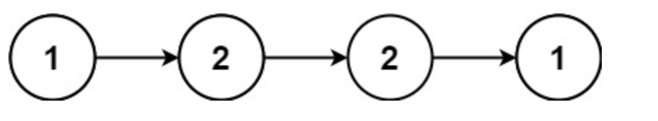
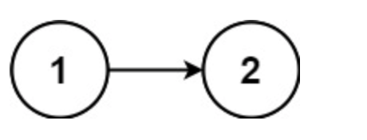

# 回文链表
## 问题
给你一个单链表的头节点 head ，请你判断该链表是否为
回文链表
。如果是，返回 true ；否则，返回 false 。


示例 1：

```
输入：head = [1,2,2,1]
输出：true
```
示例 2：


```
输入：head = [1,2]
输出：false
提示：

链表中节点数目在范围[1, 105] 内
0 <= Node.val <= 9
```


进阶：你能否用 O(n) 时间复杂度和 O(1) 空间复杂度解决此题？
## 答案(没有跑成功)
要判断一个单链表是否为回文链表，可以使用快慢指针找到链表的中点，然后反转链表的后半部分，最后比较前半部分和反转后的后半部分是否相等。
以下是具体的步骤：
1. 快慢指针找到中点：设置慢指针`slow`和快指针`fast`，`slow`每次移动一步，`fast`每次移动两步。当`fast`到达链表末尾时，`slow`恰好位于链表中点。
2. 反转链表的后半部分：从`slow`开始，反转链表的后半部分。
3. 比较前后两部分：设置两个指针，分别指向链表的前半部分和反转后的后半部分，逐一比较这两个指针所指向的节点的值是否相等。
4. 恢复链表：如果需要，可以再将链表的后半部分反转回来，但这不是必须的，题目只要求判断是否为回文链表。
5. 返回结果：如果所有对应的节点值都相等，那么链表是回文的，返回`true`；否则返回`false`。
这里提供一个基于上述步骤的 Python 代码示例：
```python
class ListNode:
    def __init__(self, val=0, next=None):
        self.val = val
        self.next = next
def isPalindrome(head: ListNode) -> bool:
# 创建链表和测试代码（示例1）
    # 边界条件处理
    if not head or not head.next:
        return True

    # 快慢指针找到链表中点
    slow = fast = head
    while fast.next and fast.next.next:
        slow = slow.next
        fast = fast.next.next

    # 反转后半部分链表
    prev = None
    curr = slow.next
    while curr:
        temp = curr.next
        curr.next = prev
        prev = curr
        curr = temp

    # 比较前后两部分链表
    p1, p2 = head, prev
    while p2:
        if p1.val != p2.val:
            return False
        p1 = p1.next
        p2 = p2.next

    return True
head = ListNode(1, ListNode(2, ListNode(2, ListNode(1))))
print(isPalindrome(head))  # 应该输出 True
# 创建链表和测试代码（示例2）
head = ListNode(1, ListNode(2))
print(isPalindrome(head))  # 应该输出 False
```
这个算法的时间复杂度是 O(n)，因为每个节点都只被访问了常数次。空间复杂度是 O(1)，因为除了几个用于迭代的变量外，没有使用额外的空间。

