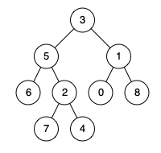

# 二叉树的最近公共祖先
## 问题
给定一个二叉树, 找到该树中两个指定节点的最近公共祖先。

百度百科中最近公共祖先的定义为：“对于有根树 T 的两个节点 p、q，最近公共祖先表示为一个节点 x，满足 x 是 p、q 的祖先且 x 的深度尽可能大（深度尽可能大意思是祖先最后比离当前节点比较近）（一个节点也可以是它自己的祖先）。”


示例 1：


```
输入：root = [3,5,1,6,2,0,8,null,null,7,4], p = 5, q = 1
输出：3
解释：节点 5 和节点 1 的最近公共祖先是节点 3 。
```
示例 2：


```
输入：root = [3,5,1,6,2,0,8,null,null,7,4], p = 5, q = 4
输出：5
解释：节点 5 和节点 4 的最近公共祖先是节点 5 。因为根据定义最近公共祖先节点可以为节点本身。
```
示例 3：
```
输入：root = [1,2], p = 1, q = 2
输出：1
```
## 解答
要找到二叉树中两个节点的最近公共祖先，可以使用递归方法。递归的基本思想是从根节点开始，递归地对左右子树进行遍历，以找到节点 p 和 q。如果在根节点为 p 或 q 的情况下找到这两个节点，那么最近公共祖先就是根节点。如果在左子树中找到这两个节点，那么最近公共祖先在左子树中；如果在右子树中找到这两个节点，那么最近公共祖先在右子树中。如果在一个子树中找到 p，在另一个子树中找到 q，那么根节点就是最近公共祖先。
以下是具体的递归步骤：
1. 如果当前节点为空，返回 null。
2. 如果当前节点是 p 或 q 中的一个，返回当前节点。
3. 递归地在左子树中查找 p 和 q。
4. 递归地在右子树中查找 p 和 q。
5. 如果 p 和 q 都在左子树中，那么 left 返回的值就是最近公共祖先。
6. 如果 p 和 q 都在右子树中，那么 right 返回的值就是最近公共祖先。
7. 如果 p 和 q 分别位于不同的子树中，或者一个节点是另一个节点的祖先，那么当前节点就是最近公共祖先。
下面是相应的 Python 代码实现：
```python
class TreeNode:
    def __init__(self, x):
        self.val = x
        self.left = None
        self.right = None
def lowestCommonAncestor(root: 'TreeNode', p: 'TreeNode', q: 'TreeNode') -> 'TreeNode':
    if not root or root == p or root == q:
        return root
    left = lowestCommonAncestor(root.left, p, q)
    right = lowestCommonAncestor(root.right, p, q)
    if left and right:
        return root
    return left if left else right
# 示例使用：
# 构建二叉树
# root = TreeNode(3)
# root.left = TreeNode(5)
# root.right = TreeNode(1)
# root.left.left = TreeNode(6)
# root.left.right = TreeNode(2)
# root.right.left = TreeNode(0)
# root.right.right = TreeNode(8)
# root.left.right.left = TreeNode(7)
# root.left.right.right = TreeNode(4)
# p = root.left
# q = root.left.right.right
# print(lowestCommonAncestor(root, p, q).val)  # 输出应该是 5
```
在这个实现中，我们首先检查当前节点是否为空，或者是否是 p 或 q 中的一个。如果是，我们返回当前节点。然后，我们在左右子树中递归地查找 p 和 q。最后，根据左右子树的返回值确定最近公共祖先。如果左右子树都返回了非空值，这意味着 p 和 q 分别位于当前节点的两侧，因此当前节点是最近公共祖先。如果只有一个子树返回了非空值，那么返回该值，这可能是 p 或 q 中的一个，或者是它们的最近公共祖先。如果两个子树都返回空值，这意味着 p 和 q 不在当前子树中，我们返回 null。

