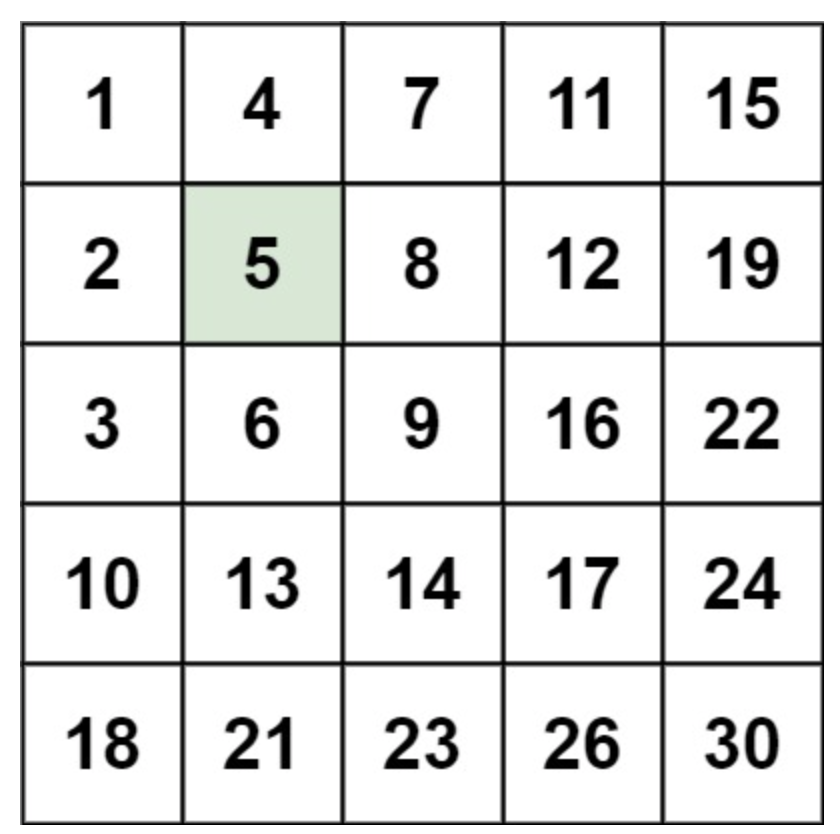
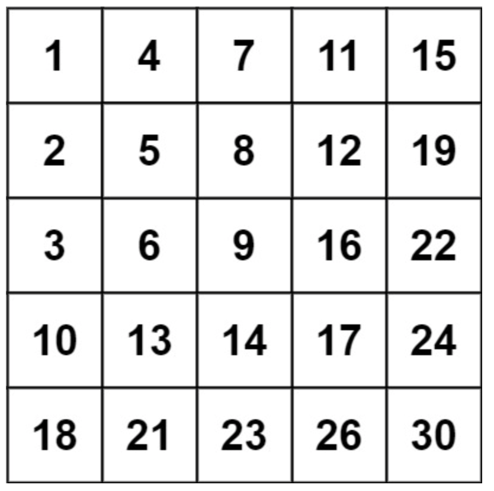

# 搜索二维矩阵(二）
## 问题
编写一个高效的算法来搜索 m x n 矩阵 matrix 中的一个目标值 target 。该矩阵具有以下特性：

每行的元素从左到右升序排列。
每列的元素从上到下升序排列。


示例 1：

```
输入：matrix = [[1,4,7,11,15],[2,5,8,12,19],[3,6,9,16,22],[10,13,14,17,24],[18,21,23,26,30]], target = 5
输出：true
```
示例 2：

```
输入：matrix = [[1,4,7,11,15],[2,5,8,12,19],[3,6,9,16,22],[10,13,14,17,24],[18,21,23,26,30]], target = 20
输出：false
```
## 答案
要搜索这样的矩阵，我们可以使用一个高效的算法，它从矩阵的右上角开始搜索。由于矩阵的行和列都是升序排列的，我们可以根据当前元素与目标值的关系来决定是向下还是向左移动。
以下是算法的步骤：
1. 从矩阵的右上角开始（记为 `matrix[0][n-1]`）。
2. 如果当前元素等于目标值，返回 `true`。
3. 如果当前元素小于目标值，向下移动一行（因为当前列的元素都小于目标值）。
4. 如果当前元素大于目标值，向左移动一列（因为当前行的元素都大于目标值）。
5. 如果越界，说明目标值不在矩阵中，返回 `false`。
以下是 Python 代码实现：
```python
def searchMatrix(matrix, target):
    if not matrix or not matrix[0]:
        return False

    m, n = len(matrix), len(matrix[0])
    row, col = 0, n - 1

    while row < m and col >= 0:
        if matrix[row][col] == target:
            return True
        elif matrix[row][col] < target:
            row += 1
        else:
            col -= 1

    return False
# 示例 1
matrix1 = [[1,4,7,11,15],[2,5,8,12,19],[3,6,9,16,22],[10,13,14,17,24],[18,21,23,26,30]]
target1 = 5
print(searchMatrix(matrix1, target1))  # 输出：true
# 示例 2
matrix2 = [[1,4,7,11,15],[2,5,8,12,19],[3,6,9,16,22],[10,13,14,17,24],[18,21,23,26,30]]
target2 = 20
print(searchMatrix(matrix2, target2))  # 输出：false
```
这个算法的时间复杂度是 O(m + n)，因为最坏的情况下，我们可能需要遍历整个矩阵的一行和一列。空间复杂度是 O(1)，因为我们只使用了常数级别的额外空间。

