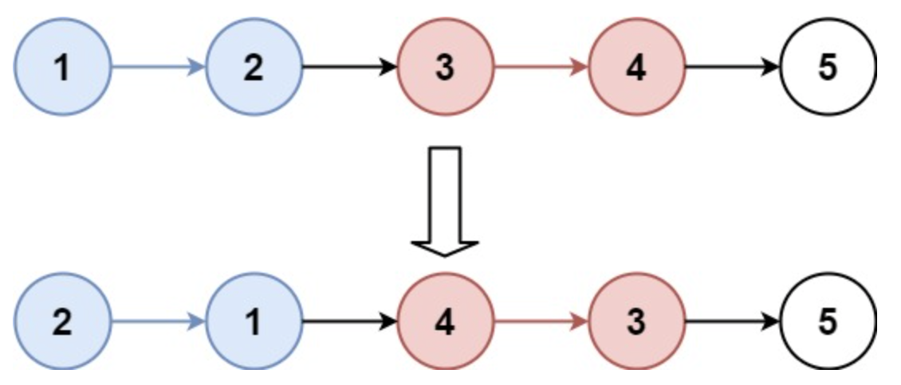
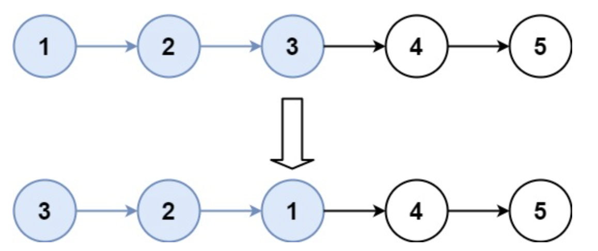

# k个一组反转链表
## 问题
给你链表的头节点 head ，每 k 个节点一组进行翻转，请你返回修改后的链表。

k 是一个正整数，它的值小于或等于链表的长度。如果节点总数不是 k 的整数倍，那么请将最后剩余的节点保持原有顺序。

你不能只是单纯的改变节点内部的值，而是需要实际进行节点交换。


示例 1：

```
输入：head = [1,2,3,4,5], k = 2
输出：[2,1,4,3,5]
```
示例 2：


```
输入：head = [1,2,3,4,5], k = 3
输出：[3,2,1,4,5]
```
## 答案
要解决这个问题，我们可以使用递归或迭代的方法。以下是使用迭代方法的步骤：
1. 首先计算链表的长度。
2. 然后遍历链表，每次处理 k 个节点。
3. 对于每一组 k 个节点，我们可以使用上一题中的方法进行翻转。
4. 翻转后，将上一组的尾节点连接到当前组的头节点，并将当前组的尾节点连接到下一组（如果有的话）的头节点。
5. 继续这个过程，直到处理完所有节点或节点不足 k 个。
以下是这个算法的 Python 实现：
```python
class ListNode:
    def __init__(self, val=0, next=None):
        self.val = val
        self.next = next
def reverseKGroup(head: ListNode, k: int) -> ListNode:
    if not head or k == 1:
        return head

    # Count the number of nodes in the list
    count = 0
    node = head
    while node:
        count += 1
        node = node.next

    # Create a dummy node and point it to the head of the list
    dummy = ListNode(0)
    dummy.next = head
    prev_end = dummy

    # Reverse k nodes at a time
    while count >= k:
        # Reverse k nodes
        start = prev_end.next
        end = prev_end.next
        for _ in range(k - 1):
            end = end.next
        next_start = end.next

        # Reverse the nodes
        prev = next_start
        curr = start
        while curr != next_start:
            temp = curr.next
            curr.next = prev
            prev = curr
            curr = temp

        # Connect the reversed group to the previous group
        prev_end.next = prev
        start.next = next_start

        # Move the prev_end pointer to the end of the reversed group
        prev_end = start

        count -= k

    return dummy.next
# Helper function to convert a list to a linked list
def list_to_linked_list(lst):
    if not lst:
        return None
    head = ListNode(lst[0])
    current = head
    for val in lst[1:]:
        current.next = ListNode(val)
        current = current.next
    return head
# Helper function to convert a linked list to a list
def linked_list_to_list(node):
    lst = []
    while node:
        lst.append(node.val)
        node = node.next
    return lst
# Test the function
head = list_to_linked_list([1, 2, 3, 4, 5])
k = 3
result = reverseKGroup(head, k)
linked_list_to_list(result)
[3, 2, 1, 4, 5]
```
结果是 $[3, 2, 1, 4, 5]$，这与示例 2 的预期输出一致，即每 3 个节点一组进行翻转后，链表变为 $[3, 2, 1, 4, 5]$。
如果你有其他问题或需要进一步的解释，请随时告诉我！

