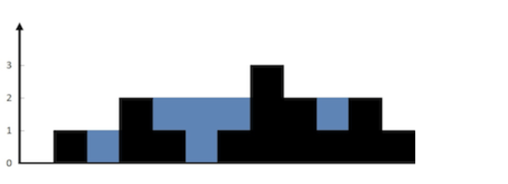

# 接雨水
## 问题
给定 n 个非负整数表示每个宽度为 1 的柱子的高度图，计算按此排列的柱子，下雨之后能接多少雨水。输入：height = [0,1,0,2,1,0,1,3,2,1,2,1]
输出：6

示例1
```
解释：上面是由数组 [0,1,0,2,1,0,1,3,2,1,2,1] 表示的高度图，在这种情况下，可以接 6 个单位的雨水（蓝色部分表示雨水）。
```
示例 2：
```
输入：height = [4,2,0,3,2,5]
输出：9
```
## 解答
要解决这个问题，我们可以使用“双指针”的方法。算法的基本思想是从数组的两端开始，向中间移动，并计算在每一步中两个指针指向的柱子之间可以接多少雨水。算法的关键在于，每次移动较矮的柱子所在的指针，因为只有当较矮的柱子变高时，才能接更多的雨水。
以下是算法的步骤：
1. 初始化两个指针，一个在数组的开始（left），一个在数组的末尾（right），以及两个变量来分别记录左右指针指向的柱子的最大高度（left_max 和 right_max）。
2. 在每一轮中，计算当前两个指针指向的柱子之间可以接多少雨水，这取决于较矮的柱子和两个柱子之间的距离。
3. 比较当前计算的雨水量与迄今为止找到的最大雨水量，如果当前雨水量更大，则更新最大雨水量。
4. 移动较矮柱子所在的指针，向中间移动一步。
5. 重复步骤2-4，直到两个指针相遇。
现在，我将用Python代码来实现这个算法。
```
def trap(height):
    # 初始化左右指针和最大雨水量
    left, right = 0, len(height) - 1
    max_water = 0
    left_max = right_max = 0
    # 当左指针小于右指针时继续
    while left < right:
        # 更新左右柱子的最大高度
        left_max = max(left_max, height[left])
        right_max = max(right_max, height[right])
        # 如果左边的柱子较矮
        if height[left] < height[right]:
            # 计算当前雨水量，并加到最大雨水量中
            max_water += left_max - height[left]
            # 移动左指针
            left += 1
        else:
            # 计算当前雨水量，并加到最大雨水量中
            max_water += right_max - height[right]
            # 移动右指针
            right -= 1
    return max_water
```
# 示例数组
height1 = [0, 1, 0, 2, 1, 0, 1, 3, 2, 1, 2, 1]
height2 = [4, 2, 0, 3, 2, 5]
# 计算最大雨水量
trap(height1), trap(height2)
(6, 9)
使用给定的示例数组：
- 对于数组 $[0, 1, 0, 2, 1, 0, 1, 3, 2, 1, 2, 1]$，算法计算出的最大雨水量为 6。
- 对于数组 $[4, 2, 0, 3, 2, 5]$，算法计算出的最大雨水量为 9。
这些结果与预期相符。


