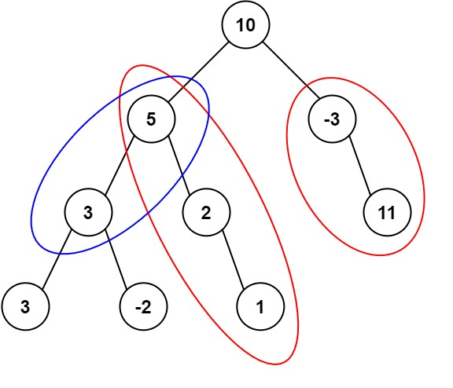

# 路径总和2
## 问题
给定一个二叉树的根节点 root ，和一个整数 targetSum ，求该二叉树里节点值之和等于 targetSum 的 路径 的数目。

路径 不需要从根节点开始，也不需要在叶子节点结束，但是路径方向必须是向下的（只能从父节点到子节点）。


示例 1：


```
输入：root = [10,5,-3,3,2,null,11,3,-2,null,1], targetSum = 8
输出：3
解释：和等于 8 的路径有 3 条，如图所示。
```
示例 2：
```
输入：root = [5,4,8,11,null,13,4,7,2,null,null,5,1], targetSum = 22
输出：3
```
## 解答
要解决这个问题，我们可以使用一个递归函数来遍历整个二叉树。在遍历过程中，我们可以记录从根节点到当前节点的路径上所有节点值的和。每当我们到达一个节点时，我们可以检查是否存在一个子路径（从任何节点开始，到当前节点结束），其节点值的和等于给定的 `targetSum`。为了高效地完成这个检查，我们可以使用一个哈希表来记录从根节点到当前节点的路径上每个可能的路径和出现的次数。
下面是解决这个问题的详细步骤：
1. 初始化一个递归函数 `countPathsWithSum`，该函数接收当前节点和当前路径和作为参数。
2. 在递归函数中，首先检查当前节点是否为空，如果是，则返回 0。
3. 更新当前路径和，加上当前节点的值。
4. 检查当前路径和减去 `targetSum` 的值是否在哈希表中。如果是，那么这意味着存在一个从某个节点到当前节点的路径，其和为 `targetSum`。将这些路径的数量累加到结果中。
5. 将当前路径和的出现次数增加 1（如果之前未出现过，则为 1）。
6. 递归地调用左子节点和右子节点，将返回的路径数累加到结果中。
7. 在递归调用返回之前，将当前路径和的出现次数减少 1，以避免影响其他路径的计算。
8. 返回累加的结果。
下面是这个算法的 Python 实现：
```python
class TreeNode:
    def __init__(self, val=0, left=None, right=None):
        self.val = val
        self.left = left
        self.right = right
def pathSum(root, targetSum):
    def countPathsWithSum(node, current_sum, path_sums):
        if not node:
            return 0

        # Update the current path sum
        current_sum += node.val

        # Count paths with the required sum starting from the root
        path_count = path_sums.get(current_sum - targetSum, 0)

        # Increment the count of the current path sum
        if current_sum in path_sums:
            path_sums[current_sum] += 1
        else:
            path_sums[current_sum] = 1

        # Count paths with the required sum in the left and right subtrees
        path_count += countPathsWithSum(node.left, current_sum, path_sums)
        path_count += countPathsWithSum(node.right, current_sum, path_sums)

        # Decrement the count of the current path sum for the upcoming backtracking
        path_sums[current_sum] -= 1
        if path_sums[current_sum] == 0:
            del path_sums[current_sum]

        return path_count

    # Dictionary to store the path sums
    path_sums = {0: 1}  # Initialize with 0 to handle paths starting from the root
    return countPathsWithSum(root, 0, path_sums)
# Example usage:
# Construct the binary tree from the given list
# root = [10,5,-3,3,2,null,11,3,-2,null,1]
# targetSum = 8
# print(pathSum(root, targetSum))  # Output should be 3
```
这个算法的时间复杂度是 O(n)，其中 n 是二叉树中节点的数量，因为我们需要访问每个节点一次。空间复杂度也是 O(n)，用于存储哈希表和递归调用栈。

