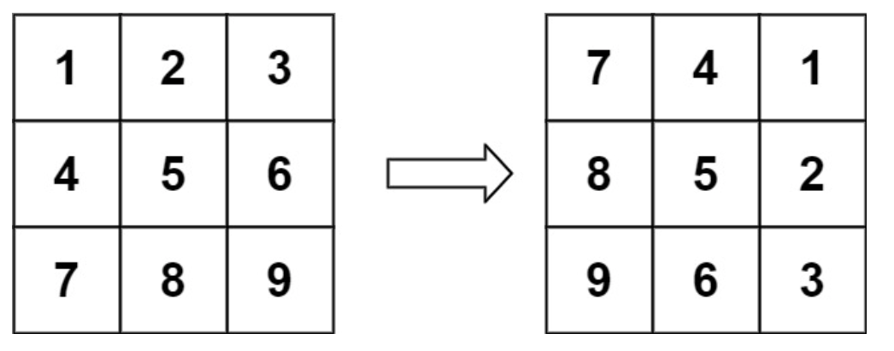
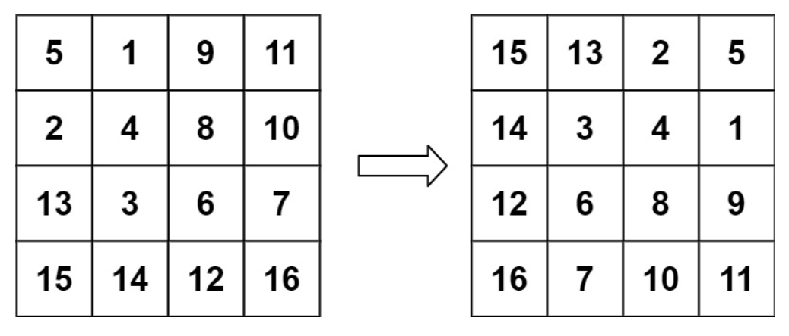

# 旋转图像
## 问题
给定一个 n × n 的二维矩阵 matrix 表示一个图像。请你将图像顺时针旋转 90 度。

你必须在 原地 旋转图像，这意味着你需要直接修改输入的二维矩阵。请不要 使用另一个矩阵来旋转图像。


示例 1：

```
输入：matrix = [[1,2,3],[4,5,6],[7,8,9]]
输出：[[7,4,1],[8,5,2],[9,6,3]]
```
示例 2：

```
输入：matrix = [[5,1,9,11],[2,4,8,10],[13,3,6,7],[15,14,12,16]]
输出：[[15,13,2,5],[14,3,4,1],[12,6,8,9],[16,7,10,11]]
```
## 答案
要原地旋转一个 n × n 的二维矩阵 90 度，可以遵循以下步骤：
1. **转置矩阵**：将矩阵的每一行转换成相应的列。
2. **反转每一行**：在转置后的矩阵中，反转每一行的元素。
下面是按照上述步骤进行原地旋转的代码实现：
```python
def rotate(matrix):
    n = len(matrix)
    # 转置矩阵
    for i in range(n):
        for j in range(i, n):
            matrix[i][j], matrix[j][i] = matrix[j][i], matrix[i][j]
    # 反转每一行
    for i in range(n):
        matrix[i].reverse()
    return matrix
```
对于示例 1 和示例 2，使用此函数将得到期望的输出：
```python
matrix1 = [[1,2,3],[4,5,6],[7,8,9]]
matrix2 = [[5,1,9,11],[2,4,8,10],[13,3,6,7],[15,14,12,16]]
print(rotate(matrix1))  # [[7,4,1],[8,5,2],[9,6,3]]
print(rotate(matrix2))  # [[15,13,2,5],[14,3,4,1],[12,6,8,9],[16,7,10,11]]
```
这个方法的时间复杂度是 O(n^2)，因为它需要遍历整个矩阵两次；空间复杂度是 O(1)，因为旋转操作是在原地进行的，不需要额外的存储空间。


