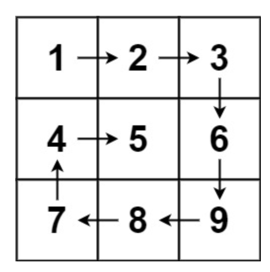
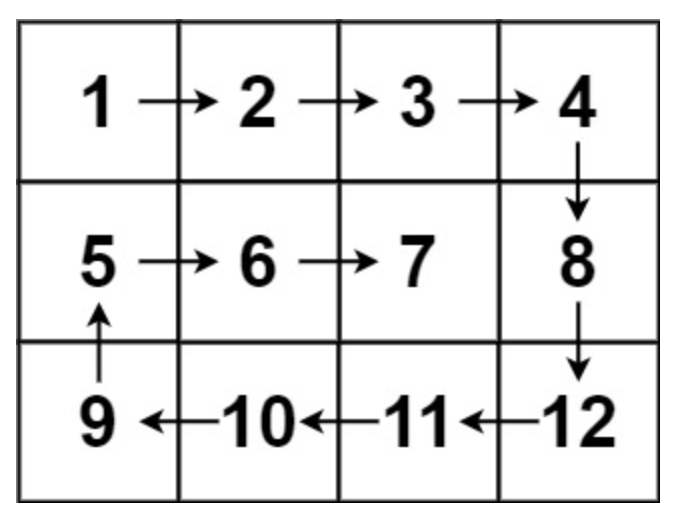

# 螺旋矩阵
## 问题
给你一个 m 行 n 列的矩阵 matrix ，请按照 顺时针螺旋顺序 ，返回矩阵中的所有元素。


示例 1：

```
输入：matrix = [[1,2,3],[4,5,6],[7,8,9]]
输出：[1,2,3,6,9,8,7,4,5]
```
示例 2：

```
输入：matrix = [[1,2,3,4],[5,6,7,8],[9,10,11,12]]
输出：[1,2,3,4,8,12,11,10,9,5,6,7]
```

## 解答
要按照顺时针螺旋顺序返回矩阵中的所有元素，我们可以模拟螺旋的路径。我们需要四个变量来分别表示当前访问的行的上下边界和列的左右边界。初始时，上边界 `top` 为 0，下边界 `bottom` 为 `m-1`，左边界 `left` 为 0，右边界 `right` 为 `n-1`。然后，我们按照顺时针的顺序遍历矩阵的边界，遍历的过程中将边界向内缩进，直到上下边界和左右边界相遇。
以下是这个算法的 Python 实现：
```python
def spiralOrder(matrix):
    if not matrix:
        return []

    m, n = len(matrix), len(matrix[0])
    result = []

    # 初始化边界
    top, bottom, left, right = 0, m - 1, 0, n - 1

    while top <= bottom and left <= right:
        # 遍历上边界
        for j in range(left, right + 1):
            result.append(matrix[top][j])
        # 上边界向内缩进
        top += 1

        # 遍历右边界
        for i in range(top, bottom + 1):
            result.append(matrix[i][right])
        # 右边界向内缩进
        right -= 1

        # 如果上下边界相交，结束循环
        if top > bottom:
            break

        # 遍历下边界
        for j in range(right, left - 1, -1):
            result.append(matrix[bottom][j])
        # 下边界向内缩进
        bottom -= 1

        # 如果左右边界相交，结束循环
        if left > right:
            break

        # 遍历左边界
        for i in range(bottom, top - 1, -1):
            result.append(matrix[i][left])
        # 左边界向内缩进
        left += 1

    return result
# 示例
matrix = [[1,2,3],[4,5,6],[7,8,9]]
print(spiralOrder(matrix))  # 输出: [1,2,3,6,9,8,7,4,5]
matrix = [[1,2,3,4],[5,6,7,8],[9,10,11,12]]
print(spiralOrder(matrix))  # 输出: [1,2,3,4,8,12,11,10,9,5,6,7]
```
这个算法的时间复杂度是 O(m*n)，因为我们遍历了矩阵中的每个元素一次。空间复杂度是 O(1)，除了输出结果之外，我们只使用了常数级别的额外空间。

