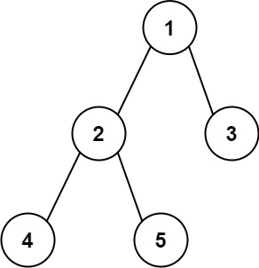

# 二叉树的直径
## 问题
给你一棵二叉树的根节点，返回该树的 直径 。

二叉树的 直径 是指树中任意两个节点之间最长路径的 长度 。这条路径可能经过也可能不经过根节点 root 。

两节点之间路径的 长度 由它们之间边数表示。

 

示例 1：

```
输入：root = [1,2,3,4,5]
输出：3
解释：3 ，取路径 [4,2,1,3] 或 [5,2,1,3] 的长度。
```
示例 2：
```
输入：root = [1,2]
输出：1
```
## 解答
为了计算二叉树的直径，我们需要计算每个节点的左子树和右子树的最大深度，并更新直径的最大值。直径可以通过左子树的最大深度加上右子树的最大深度来计算。以下是一个可能的Python实现：
### 知识准备
函数用到了nonlocal，对nonlocal进行解释  

在Python中，`nonlocal`是一个关键字，用于在嵌套函数中声明变量。当你在内部函数中想要修改外部函数（但不是全局）的变量时，你需要使用`nonlocal`关键字来指明这个变量。
在Python的作用域规则中，默认情况下，在函数内部赋值的变量被认为是局部变量。如果在函数内部想要修改外部函数的变量，就需要使用`nonlocal`关键字来指明这个变量不是局部变量，而是外部函数的变量。
例如：
```python
def outer_function():
    x = 10
    def inner_function():
        nonlocal x  # 声明x是外部函数的变量
        x = 20
    inner_function()
    return x
print(outer_function())  # 输出: 20
```
在上面的例子中，`inner_function`内部的`x`被声明为`nonlocal`，这意味着它引用的是`outer_function`中的`x`。因此，当`inner_function`修改`x`的值时，实际上是修改了`outer_function`中的`x`。
如果没有`nonlocal`关键字，Python会认为`inner_function`中的`x`是一个局部变量，当你尝试修改它时，Python会创建一个新的局部变量`x`，而不是修改外部函数中的`x`。
在全局变量的情况下，使用`global`关键字来声明变量。`global`和`nonlocal`的区别在于，`global`用于声明全局变量，而`nonlocal`用于声明外部函数（但不是全局）的变量。
### 解答程序
```python
class TreeNode:
    def __init__(self, val=0, left=None, right=None):
        self.val = val
        self.left = left
        self.right = right
def diameterOfBinaryTree(root: TreeNode) -> int:
    def depth(node: TreeNode) -> int:
        if not node:
            return 0
        left_depth = depth(node.left)
        right_depth = depth(node.right)
        # 更新直径的最大值
        nonlocal max_diameter
        max_diameter = max(max_diameter, left_depth + right_depth)
        # 返回当前节点的最大深度
        return max(left_depth, right_depth) + 1
    max_diameter = 0
    depth(root)
    return max_diameter
# 示例使用
root1 = TreeNode(1, TreeNode(2, TreeNode(4), TreeNode(5)), TreeNode(3))
root2 = TreeNode(1, TreeNode(2))
print(diameterOfBinaryTree(root1))  # 输出: 3
print(diameterOfBinaryTree(root2))  # 输出: 1
```
在这个实现中，我们定义了一个内部函数 `depth` 来计算每个节点的最大深度，并在计算过程中更新直径的最大值。`depth` 函数递归地计算左子树和右子树的最大深度，并返回当前节点的最大深度。`max_diameter` 是一个非局部变量，用于在递归过程中更新直径的最大值。
最后，我们调用 `depth` 函数来计算根节点的最大深度，并返回计算出的直径最大值。

