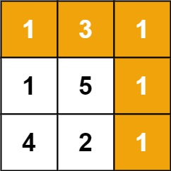

# 最小路径和
## 问题
给定一个包含非负整数的 m x n 网格 grid ，请找出一条从左上角到右下角的路径，使得路径上的数字总和为最小。

说明：每次只能向下或者向右移动一步。


示例 1：


```
输入：grid = [[1,3,1],[1,5,1],[4,2,1]]
输出：7
解释：因为路径 1→3→1→1→1 的总和最小。
```
示例 2：
```
输入：grid = [[1,2,3],[4,5,6]]
输出：12
```
## 解答
这个问题可以通过动态规划来解决。我们可以创建一个同样大小的网格 dp，其中 dp[i][j] 表示从左上角到达网格 (i, j) 的路径上的数字总和的最小值。对于网格的边界，我们有以下初始化：
- dp[0][0] = grid[0][0]，因为这是起点。
- 对于第一行 dp[0][j]，因为只能从左边到达，所以 dp[0][j] = dp[0][j-1] + grid[0][j]。
- 对于第一列 dp[i][0]，因为只能从上面到达，所以 dp[i][0] = dp[i-1][0] + grid[i][0]。
对于其他的位置 (i, j)，我们可以从左边 (dp[i][j-1]) 或上面 (dp[i-1][j]) 到达，所以我们需要选择这两个方向中路径总和较小的那个，并加上当前位置的值 grid[i][j]。因此，状态转移方程为：
dp[i][j] = min(dp[i-1][j], dp[i][j-1]) + grid[i][j]
最后，dp[m-1][n-1] 就是我们要找的从左上角到右下角路径的最小数字总和。
现在，我将使用 Python 来实现这个动态规划算法。
```python
def min_path_sum(grid: list[list[int]]) -> int:
    m, n = len(grid), len(grid[0])
    dp = [[0] * n for _ in range(m)]
    # 初始化
    dp[0][0] = grid[0][0]
    for j in range(1, n):
        dp[0][j] = dp[0][j-1] + grid[0][j]
    for i in range(1, m):
        dp[i][0] = dp[i-1][0] + grid[i][0]
    # 状态转移
    for i in range(1, m):
        for j in range(1, n):
            dp[i][j] = min(dp[i-1][j], dp[i][j-1]) + grid[i][j]
    return dp[m-1][n-1]
# 测试示例
test_cases = [[[1,3,1],[1,5,1],[4,2,1]], [[1,2,3],[4,5,6]]]
results = [min_path_sum(tc) for tc in test_cases]
results
[7, 12]
```
根据计算结果，我们得到以下答案：
- 对于网格 $\left[\begin{array}{ccc} 1 & 3 & 1 \\ 1 & 5 & 1 \\ 4 & 2 & 1 \end{array}\right]$，从左上角到右下角的最小路径总和为 7。
- 对于网格 $\left[\begin{array}{cc} 1 & 2 & 3 \\ 4 & 5 & 6 \end{array}\right]$，从左上角到右下角的最小路径总和为 12。
这些结果与示例中的预期输出相符。

