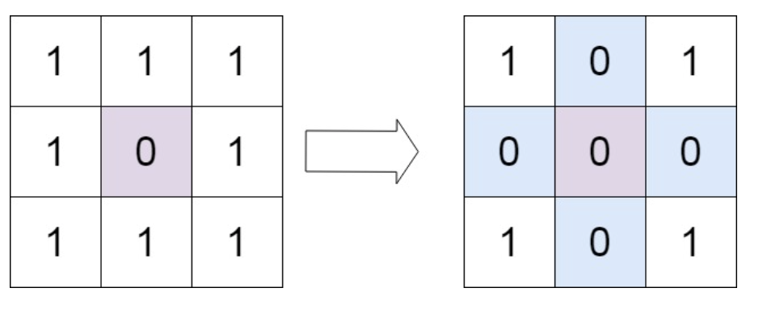
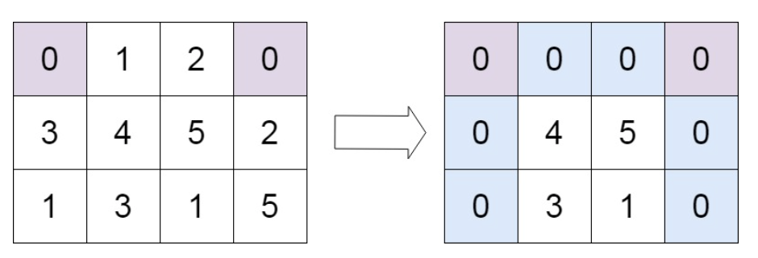

# 矩阵置零
## 问题
给定一个 m x n 的矩阵，如果一个元素为 0 ，则将其所在行和列的所有元素都设为 0 。请使用 原地 算法。


示例 1：


```
输入：matrix = [[1,1,1],[1,0,1],[1,1,1]]
输出：[[1,0,1],[0,0,0],[1,0,1]]
```
示例 2：

```
输入：matrix = [[0,1,2,0],[3,4,5,2],[1,3,1,5]]
输出：[[0,0,0,0],[0,4,5,0],[0,3,1,0]]
```
## 解答
要解决这个问题，我们可以使用两个集合来分别记录需要置为0的行和列。首先遍历整个矩阵，当遇到一个0时，将它的行和列的索引添加到这两个集合中。然后再次遍历矩阵，将集合中的行和列的所有元素置为0。
以下是这个算法的 Python 实现：
```python
def setZeroes(matrix):
    if not matrix:
        return

    m, n = len(matrix), len(matrix[0])
    row_set = set()
    col_set = set()

    # 遍历矩阵，记录需要置为0的行和列
    for i in range(m):
        for j in range(n):
            if matrix[i][j] == 0:
                row_set.add(i)
                col_set.add(j)

    # 再次遍历矩阵，将需要置为0的行和列的元素置为0
    for i in range(m):
        for j in range(n):
            if i in row_set or j in col_set:
                matrix[i][j] = 0
# 示例
matrix = [[1,1,1],[1,0,1],[1,1,1]]
setZeroes(matrix)
print(matrix)  # 输出: [[1,0,1],[0,0,0],[1,0,1]]
matrix = [[0,1,2,0],[3,4,5,2],[1,3,1,5]]
setZeroes(matrix)
print(matrix)  # 输出: [[0,0,0,0],[0,4,5,0],[0,3,1,0]]
```
这个算法的时间复杂度是 O(m*n)，空间复杂度是 O(m+n)，其中 m 和 n 分别是矩阵的行数和列数。这是因为我们需要遍历矩阵两次，并且使用了两个集合来存储行和列的索引。虽然空间复杂度不是常数，但在题目要求的 O(m*n) 时间复杂度内完成了操作。如果题目要求严格的常数空间复杂度，我们可以使用矩阵的第一行和第一列来存储行和列是否需要置为0的信息，从而避免使用额外的集合空间。

