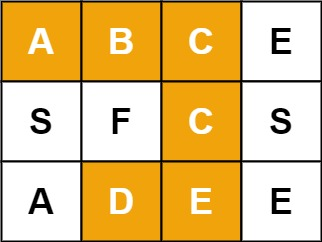

# 单词搜索
## 问答
给定一个 m x n 二维字符网格 board 和一个字符串单词 word 。如果 word 存在于网格中，返回 true ；否则，返回 false 。

单词必须按照字母顺序，通过相邻的单元格内的字母构成，其中“相邻”单元格是那些水平相邻或垂直相邻的单元格。同一个单元格内的字母不允许被重复使用。


示例 1：


```
输入：board = [["A","B","C","E"],["S","F","C","S"],["A","D","E","E"]], word = "ABCCED"
输出：true
```
示例 2：


```
输入：board = [["A","B","C","E"],["S","F","C","S"],["A","D","E","E"]], word = "SEE"
输出：true
```
示例 3：


```
输入：board = [["A","B","C","E"],["S","F","C","S"],["A","D","E","E"]], word = "ABCB"
输出：false
```
## 解答
要解决这个问题，我们可以使用回溯算法。回溯算法是一种通过探索所有可能的候选解来找出所有的解的算法。如果候选解被确认不是一个解（或者至少不是最后一个解），回溯算法会通过在上一步进行一些变化丢弃该解，即回溯并且再次尝试。
下面是一个使用Python实现的回溯算法来解决这个问题的例子：
```python
def exist(board, word):
    def backtrack(row, col, index):
        # 如果索引到达单词的末尾，说明找到了一个匹配
        if index == len(word):
            return True
        # 边界检查和越界情况
        if row < 0 or row >= len(board) or col < 0 or col >= len(board[0]) or board[row][col] != word[index]:
            return False
        # 标记当前位置已经访问过
        temp, board[row][col] = board[row][col], '/'
        # 尝试上下左右四个方向
        found = backtrack(row + 1, col, index + 1) or \
                backtrack(row - 1, col, index + 1) or \
                backtrack(row, col + 1, index + 1) or \
                backtrack(row, col - 1, index + 1)
        # 回溯，恢复当前位置的字符
        board[row][col] = temp
        return found
    for i in range(len(board)):
        for j in range(len(board[0])):
            if backtrack(i, j, 0):
                return True
    return False
# 示例
board = [["A","B","C","E"],["S","F","C","S"],["A","D","E","E"]]
word = "ABCCED"
print(exist(board, word))  # 输出：True
```
在这个实现中，我们定义了一个内部的回溯函数 `backtrack`，它接受当前行 `row`、当前列 `col` 和当前单词的索引 `index`。我们首先检查索引是否已经到达单词的末尾，如果是，则说明我们找到了一个匹配。然后我们检查当前位置的字符是否与单词中的字符匹配，如果不匹配或者位置越界，则返回 `False`。如果匹配，我们暂时将当前位置的字符标记为已访问（通过替换为字符 `'/'`），然后尝试向四个方向（上、下、左、右）递归搜索。如果任何方向上的搜索找到了匹配，我们返回 `True`。在返回之前，我们恢复当前位置的字符，以便其他路径可以使用它。
最后，我们遍历整个棋盘，从每个位置开始调用 `backtrack` 函数，如果任何调用返回 `True`，则整个函数返回 `True`，表示找到了单词。如果遍历完整个棋盘都没有找到，则返回 `False`。

