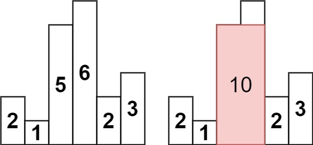

# 柱状图中最大矩形
## 问题
给定 n 个非负整数，用来表示柱状图中各个柱子的高度。每个柱子彼此相邻，且宽度为 1 。

求在该柱状图中，能够勾勒出来的矩形的最大面积。


示例 1:


```
输入：heights = [2,1,5,6,2,3]
输出：10
解释：最大的矩形为图中红色区域，面积为 10
```
示例 2：


```
输入： heights = [2,4]
输出： 4
```
## 解答
要解决这个问题，我们可以使用单调栈的数据结构。单调栈是一种特殊的栈，用于解决一类需要维护数据单调性的问题。在这个问题中，我们需要找到每个柱子左右两边第一个比它矮的柱子，这样我们就可以计算以这个柱子为高的最大矩形面积。
算法步骤如下：
1. 初始化一个栈 `stack`，用于存储柱子的索引。我们还需要在数组的开始和结束分别添加高度为 0 的柱子，以便处理边界情况。
2. 遍历数组 `heights`，对于每个索引 `i`：
   - 当栈不为空且 `heights[i]` 小于栈顶索引对应的 `heights` 值时，说明我们找到了栈顶索引对应柱子的右边界。我们可以计算以栈顶索引对应柱子为高的矩形面积，并将其更新为最大面积。
   - 将当前索引 `i` 压入栈中。
3. 遍历完成后，栈中可能还有剩余的索引，我们需要对它们进行处理，计算以这些柱子为高的矩形面积。
现在，我将为你编写相应的代码。
```python
def largestRectangleArea(heights):
    # 在数组的开始和结束分别添加高度为 0 的柱子
    heights = [0] + heights + [0]
    max_area = 0
    stack = []
    for i, h in enumerate(heights):
        # 当栈不为空且当前柱子高度小于栈顶索引对应的高度时
        while stack and heights[stack[-1]] > h:
            # 弹出栈顶元素
            height = heights[stack.pop()]
            # 计算宽度
            width = i - stack[-1] - 1
            # 更新最大面积
            max_area = max(max_area, height * width)
        # 将当前索引压入栈中
        stack.append(i)
    return max_area
# 测试示例
test_cases = [
    [2, 1, 5, 6, 2, 3],
    [2, 4]
]
results = [largestRectangleArea(tc) for tc in test_cases]
results
[10, 4]
```
代码的输出结果与示例一致：
- 对于输入 `heights = [2, 1, 5, 6, 2, 3]`，输出是 `10`。
- 对于输入 `heights = [2, 4]`，输出是 `4`。
这个算法可以有效地计算柱状图中能够勾勒出来的最大矩形面积。

