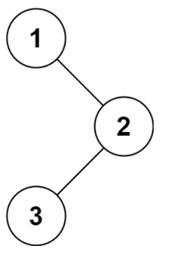

# 二叉树的中序遍历
## 背景知识
二叉树的前序遍历、中序遍历和后序遍历是三种常见的遍历方式，它们分别按照不同的顺序访问二叉树的节点。

1. 前序遍历（Preorder Traversal）：
   - 访问顺序：根 - 左 - 右
   - 过程：首先访问根节点，然后前序遍历左子树，最后前序遍历右子树。
2. 中序遍历（Inorder Traversal）：
   - 访问顺序：左 - 根 - 右
   - 过程：首先中序遍历左子树，然后访问根节点，最后中序遍历右子树。
3. 后序遍历（Postorder Traversal）：
   - 访问顺序：左 - 右 - 根
   - 过程：首先后序遍历左子树，然后后序遍历右子树，最后访问根节点。

**可以认为前序，中序和后续都是指的根节点的位置，左右都是先左后右.**

下面是使用递归方法实现这三种遍历的Python代码：
```python
# Definition for a binary tree node.
# class TreeNode:
#     def __init__(self, val=0, left=None, right=None):
#         self.val = val
#         self.left = left
#         self.right = right
class Solution:
    def preorderTraversal(self, root: TreeNode) -> List[int]:
        def preorder(node):
            if not node:
                return
            res.append(node.val)
            preorder(node.left)
            preorder(node.right)

        res = []
        preorder(root)
        return res
    def inorderTraversal(self, root: TreeNode) -> List[int]:
        def inorder(node):
            if not node:
                return
            inorder(node.left)
            res.append(node.val)
            inorder(node.right)

        res = []
        inorder(root)
        return res
    def postorderTraversal(self, root: TreeNode) -> List[int]:
        def postorder(node):
            if not node:
                return
            postorder(node.left)
            postorder(node.right)
            res.append(node.val)

        res = []
        postorder(root)
        return res
```
对于给定的二叉树：
```
    1
   / \
  2   3
 / \
4   5
```
三种遍历的结果分别是：
- 前序遍历：[1, 2, 4, 5, 3]
- 中序遍历：[4, 2, 5, 1, 3]
- 后序遍历：[4, 5, 2, 3, 1]
这个算法的时间复杂度是O(n)，其中n是二叉树中节点的数量，因为每个节点都会被访问一次。空间复杂度是O(n)，因为在最坏的情况下（当二叉树退化成链表时），递归栈的深度可以达到n。

## 问题
给定一个二叉树的根节点 root ，返回 它的 中序 遍历 。


示例 1：

```
输入：root = [1,null,2,3]
输出：[1,3,2]
```
示例 2：
```
输入：root = []
输出：[]
```
示例 3：
```
输入：root = [1]
输出：[1]
```
## 解答
二叉树的中序遍历是一种遍历算法，按照“左-根-右”的顺序访问二叉树的所有节点。下面是使用递归方法实现中序遍历的Python代码：
```python
# Definition for a binary tree node.
# class TreeNode:
#     def __init__(self, val=0, left=None, right=None):
#         self.val = val
#         self.left = left
#         self.right = right
class Solution:
    def inorderTraversal(self, root: TreeNode) -> List[int]:
        def inorder(node):
            if not node:
                return
            inorder(node.left)
            res.append(node.val)
            inorder(node.right)

        res = []
        inorder(root)
        return res
```
在这个代码中，我们定义了一个辅助函数`inorder`，它接受一个节点作为参数，并按照中序遍历的顺序访问节点。如果节点为空，则直接返回；否则，先递归地访问左子树，然后访问当前节点，最后递归地访问右子树。在访问每个节点时，将其值添加到结果列表`res`中。
对于给定的示例：
```python
# 示例 1
root = TreeNode(1)
root.right = TreeNode(2)
root.right.left = TreeNode(3)
print(Solution().inorderTraversal(root))  # 输出: [1, 3, 2]
# 示例 2
root = None
print(Solution().inorderTraversal(root))  # 输出: []
# 示例 3
root = TreeNode(1)
print(Solution().inorderTraversal(root))  # 输出: [1]
```
这个算法的时间复杂度是O(n)，其中n是二叉树中节点的数量，因为每个节点都会被访问一次。空间复杂度是O(n)，因为在最坏的情况下（当二叉树退化成链表时），递归栈的深度可以达到n。

