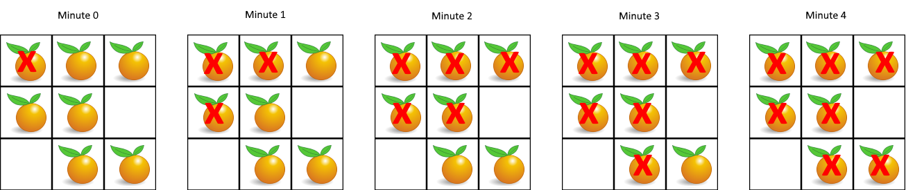

# 腐烂的橘子
## 问题
在给定的 m x n 网格 grid 中，每个单元格可以有以下三个值之一：

值 0 代表空单元格；
值 1 代表新鲜橘子；
值 2 代表腐烂的橘子。
每分钟，腐烂的橘子 周围 4 个方向上相邻 的新鲜橘子都会腐烂。

返回 直到单元格中没有新鲜橘子为止所必须经过的最小分钟数。如果不可能，返回 -1 。


示例 1：


```
输入：grid = [[2,1,1],[1,1,0],[0,1,1]]
输出：4
```
示例 2：
```
输入：grid = [[2,1,1],[0,1,1],[1,0,1]]
输出：-1
解释：左下角的橘子（第 2 行， 第 0 列）永远不会腐烂，因为腐烂只会发生在 4 个方向上。
```
示例 3：
```
输入：grid = [[0,2]]
输出：0
解释：因为 0 分钟时已经没有新鲜橘子了，所以答案就是 0 。
```
## 解答
要解决这个问题，我们可以使用广度优先搜索（BFS）算法。算法的基本思想是从所有腐烂的橘子开始，逐层（即分钟数）向外扩展，将新鲜橘子变为腐烂橘子。我们可以使用一个队列来存储每一分钟要腐烂的橘子的位置。
下面是具体的算法步骤：
1. 初始化一个队列 `queue`，用于存储腐烂橘子的位置。
2. 遍历网格，将所有腐烂橘子的位置加入队列中。
3. 初始化一个变量 `minutes`，用于记录分钟数，初始为 0。
4. 当队列不为空时，进行以下操作：
   - 获取队列的长度，这表示当前分钟有多少个橘子会腐烂。
   - 遍历这些橘子，对每个橘子，检查其四个方向上是否有新鲜橘子，如果有，将其变为腐烂橘子，并将其位置加入队列中。
   - 完成遍历后，分钟数加一。
5. 在每次分钟结束时，检查是否有新鲜橘子剩余，如果没有，返回当前分钟数；如果有，继续下一分钟的操作。
6. 如果队列为空且仍有新鲜橘子，返回 -1。
下面是这个算法的 Python 实现：
```python 
from collections import deque
def oranges_rotting(grid):
    m, n = len(grid), len(grid[0])
    fresh_oranges = 0
    queue = deque()
    # 遍历网格，统计新鲜橘子和腐烂橘子的位置
    for i in range(m):
        for j in range(n):
            if grid[i][j] == 2:
                queue.append((i, j))
            elif grid[i][j] == 1:
                fresh_oranges += 1
    # 初始化分钟数
    minutes = 0
    # 四个方向
    directions = [(0, 1), (1, 0), (0, -1), (-1, 0)]
    # 当队列不为空或有新鲜橘子时，继续
    while queue and fresh_oranges > 0:
        minutes += 1
        for _ in range(len(queue)):
            x, y = queue.popleft()
            for dx, dy in directions:
                nx, ny = x + dx, y + dy
                if 0 <= nx < m and 0 <= ny < n and grid[nx][ny] == 1:
                    grid[nx][ny] = 2
                    queue.append((nx, ny))
                    fresh_oranges -= 1
    # 如果还有新鲜橘子，返回 -1
    if fresh_oranges > 0:
        return -1
    else:
        return minutes
# 测试示例
example1 = [[2,1,1],[1,1,0],[0,1,1]]
example2 = [[2,1,1],[0,1,1],[1,0,1]]
example3 = [[0,2]]
oranges_rotting(example1), oranges_rotting(example2), oranges_rotting(example3)
(4, -1, 0)
```
对于给定的示例：
- 对于网格 $\left[\begin{array}{ccc} 2 & 1 & 1 \\ 1 & 1 & 0 \\ 0 & 1 & 1 \end{array}\right]$，输出为 4，表示需要 4 分钟才能使所有新鲜橘子腐烂。
- 对于网格 $\left[\begin{array}{ccc} 2 & 1 & 1 \\ 0 & 1 & 1 \\ 1 & 0 & 1 \end{array}\right]$，输出为 -1，表示左下角的橘子永远不会腐烂。
- 对于网格 $\left[\begin{array}{cc} 0 & 2 \end{array}\right]$，输出为 0，表示一开始就没有新鲜橘子。
这与示例中的解释相匹配。

