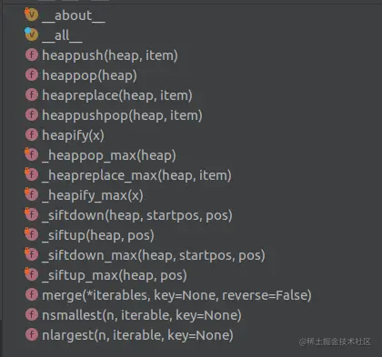

# 二叉树的介绍
在二叉搜索树中，对于任何节点n，都有以下性质：

1. 左子树的所有节点的值都小于节点n的值。
2. 右子树的所有节点的值都大于节点n的值。
3. 左右子树也都是二叉搜索树。
## 搜索二叉树

## 平衡二叉树
# python中自有的堆，栈和队列
## 堆的介绍

小顶堆（Min-Heap）是一种完全二叉树，满足任何一个父节点的值都小于或等于其子节点的值的特性。但是，这并不意味着左子节点的值一定小于右子节点的值。在小顶堆中，父节点的值只是小于或等于其两个子节点的值，并不限定左右子节点之间的大小关系。因此，小顶堆的左子节点不一定小于右子节点。

**注意:**区分于搜索二叉树，搜索二叉树有这个性质。搜索二叉树是node节点，堆是list。
## 堆
### 堆的功能
1. topK问题
2. 合并有序数组
3. 堆排序
### 相关介绍
python中的堆一般用来做大堆，小堆，可以解决topK的问题
heapq 对外暴露的方法：



感觉`heapq`就是一种操作，数据载体可以是list或者字典(需要key，value的形式）,当由于输入载体过来的时候，记录下数据载体的key和value，然后再heapq内部，用list存储key，做一个堆。

heapq 的存取方法有3种：
### 1. 不限制数量，一个一个插入

使用list，list用来存储,一个一个往里面插入(合并k个升序链表可以用到)
```
heap = []
heapq.heappush(heap,(head.val,i))# 这个默认是小顶堆 # 存
val,idx = heapq.heappop(heap)# 读出来这个数 # 取
```
### 2. 不限制数量，一下子插入

使用list，list一下子插进去:
```
heapq.heapify(array) # 存，array，改变了，直接带取
print("array:", array)
#array: [1, 2, 5, 3, 4]
```
### 3. 限制数量为`k`

k个大顶堆
```
import heapq
from collections import Counter
nums = [1,1,1,2,2,3]
freq = Counter(nums)
# 构建一个最小堆，大小为k
heapq.nlargest(k, freq.keys(), key=freq.get) # 带存带取

data = [1, 3, 5, 7, 9, 2, 4, 6, 8, 0]

# 获取最大的3个元素
print(heapq.nlargest(3, data))  # 输出: [9, 8, 7]

# 获取最小的3个元素
print(heapq.nsmallest(3, data))  # 输出: [0, 1, 2]
```

用到的有:   
[前K个高频元素](./347.md)

[合并K个升序链表](./23.md)

heapq的源码在`/Users/pan/anaconda3/lib/python3.8/heapq.py`中，可以查看
## 栈
通常用list,入栈就是append，出栈就是pop，list有这个方法。

在Python中，栈（Stack）是一种后进先出（Last In First Out, LIFO）的数据结构。虽然Python没有内置的栈类型，但是可以使用列表（List）来轻松地实现栈的所有功能。栈的基本操作包括压栈（push）、弹栈（pop）和查看栈顶元素（peek）。
以下是使用Python列表来实现栈的简单例子：
```python
class Stack:
    def __init__(self):
        self.items = []
    def is_empty(self):
        return self.items == []
    def push(self, item):
        self.items.append(item)#通常用list,入栈就是append，出栈就是pop，list有这个方法。

    def pop(self):
        if not self.is_empty():
            return self.items.pop()#通常用list,入栈就是append，出栈就是pop，list有这个方法。

        else:
            raise IndexError("pop from empty stack")
    def peek(self):
        if not self.is_empty():
            return self.items[-1]
        else:
            raise IndexError("peek from empty stack")
    def size(self):
        return len(self.items)
# 使用栈
stack = Stack()
stack.push(1)
stack.push(2)
stack.push(3)
print(stack.peek())  # 输出: 3
print(stack.pop())   # 输出: 3
print(stack.size())  # 输出: 2
```
在这个例子中，我们定义了一个`Stack`类，它使用一个列表`self.items`来存储栈中的元素。`push`方法将元素添加到栈顶，`pop`方法移除并返回栈顶元素，`peek`方法返回栈顶元素但不移除它，`is_empty`方法检查栈是否为空，`size`方法返回栈中元素的数量。
由于列表的`append`和`pop`方法在尾部操作时的时间复杂度为O(1)，所以使用列表实现的栈在压栈和弹栈操作上是非常高效的。
除了使用类来实现栈，你也可以直接使用列表和它的方法来模拟栈的行为：
```python
stack = []  # 创建一个空栈
stack.append(1)  # 压栈
stack.append(2)
stack.append(3)
top_element = stack[-1]  # 查看栈顶元素
print(top_element)  # 输出: 3
popped_element = stack.pop()  # 弹栈
print(popped_element)  # 输出: 3
print(len(stack))  # 输出栈的大小: 2
```
在实际应用中，栈被广泛用于算法、程序语言解析、括号匹配、后缀表达式求值、函数调用、浏览器历史记录管理等场景。

## 队列
`deque`（double-ended queue，双端队列）是Python标准库`collections`模块中的一个数据结构，它支持在队列的两端以常数时间复杂度进行元素的插入和删除操作。`deque`是一种高效且线程安全的数据结构，适用于需要频繁在两端添加或删除元素的场景。
以下是`deque`的一些特点和使用方法：
1. **线程安全**：`deque`是线程安全的，可以在多线程环境中安全地使用。
2. **内存效率**：`deque`的内存效率高于列表，因为它不需要像列表那样在插入或删除元素时进行大量的元素移动。
3. **有界大小**：`deque`可以设定最大长度，当队列满时，新添加的元素会从另一端移除，这在某些场景下非常有用，比如实现一个固定大小的数据缓存。
4. **方法丰富**：`deque`提供了丰富的方法来操作队列，如`append()`、`appendleft()`、`pop()`、`popleft()`、`extend()`、`extendleft()`等。
下面是一个使用`deque`的例子：
```python
from collections import deque
# 创建一个双端队列
d = deque([1, 2, 3])
# 在右侧添加元素
d.append(4)  # deque([1, 2, 3, 4])
# 在左侧添加元素
d.appendleft(0)  # deque([0, 1, 2, 3, 4])
# 从右侧弹出元素
d.pop()  # 4, deque([0, 1, 2, 3])
# 从左侧弹出元素
d.popleft()  # 0, deque([1, 2, 3])
# 扩展队列右侧
d.extend([4, 5])  # deque([1, 2, 3, 4, 5])
# 扩展队列左侧
d.extendleft([-1, 0])  # deque([-1, 0, 1, 2, 3, 4, 5])
# 获取队列长度
len(d)  # 7
# 遍历队列
for item in d:
    print(item)
```
`deque`是一个非常有用的数据结构，尤其适用于那些需要频繁在数据两端进行操作的场景，比如实现一个宽度优先搜索（BFS）算法或者作为一个缓冲区来管理数据流。

